# Anchor Engine Architecture Diagrams

**Audience:** Human readers (developers, researchers, users)  
**Purpose:** Visual system understanding  
**Last Updated:** February 23, 2026

---

## System Overview

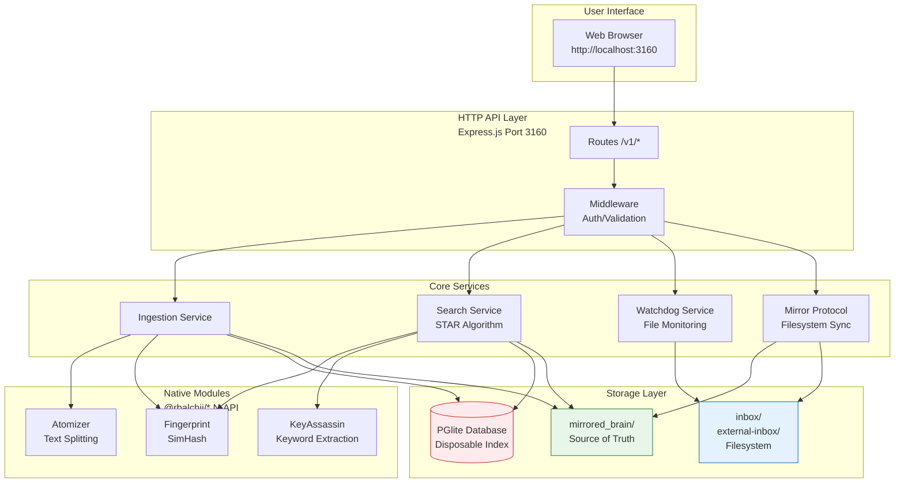

**Key Components:**

1. **UI Layer** - React/Vite frontend at http://localhost:3160
2. **HTTP API** - Express.js REST API on port 3160
3. **Core Services** - Ingestion, Search (STAR), Watchdog, Mirror
4. **Native Modules** - C++ N-API for performance (@rbalchii/* packages)
5. **Storage** - PGlite database (disposable) + mirrored_brain/ (persistent)

---

## Data Model: Compound → Molecule → Atom

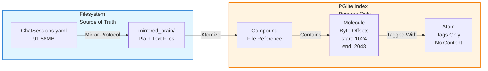

**Key Insight:** Content lives in `mirrored_brain/` filesystem. Database stores **pointers only** (byte offsets + tags), making it **disposable and rebuildable**.

---

## STAR Search Algorithm Flow

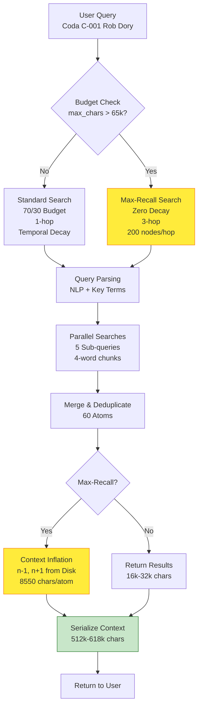

**Unified Field Equation:**
```
Gravity = (SharedTags) × e^(-λΔt) × (1 - SimHashDistance/64)
```

---

## Deduplication Pipeline (5-Layer)

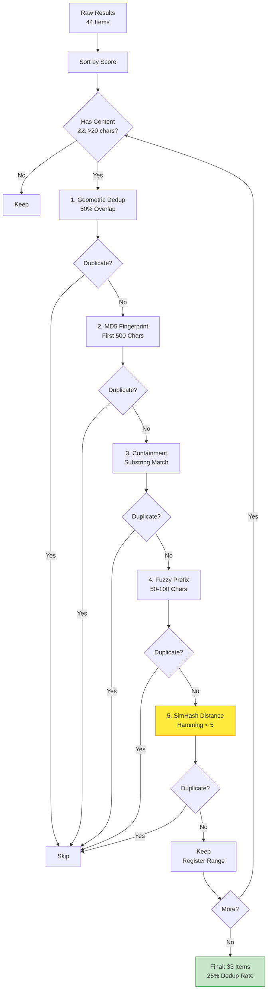

**Dedup Layers:**
1. **Geometric** - Same-file overlapping windows
2. **Content Fingerprint** - Cross-file exact duplicates (MD5)
3. **Containment** - One result is subset of another
4. **Fuzzy Prefix** - Near-exact with whitespace/timestamp diffs
5. **SimHash Distance** - Cross-file near-duplicates (NEW v4.1.2)

---

## Context Inflation: n-1, n+1 Expansion

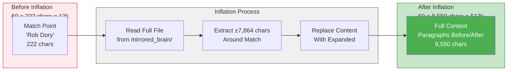

**Impact:** 13k chars → 513k chars (39x increase)

---

## Time Ordering Toggle

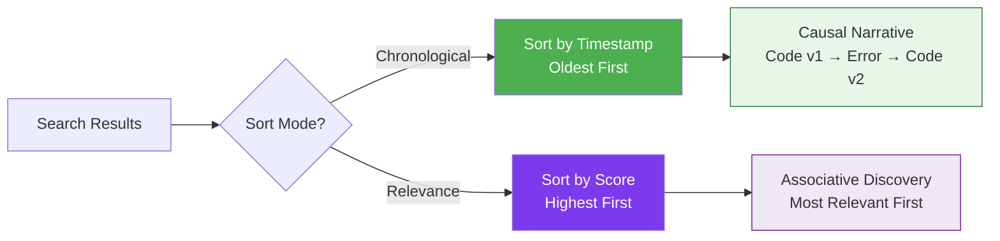

**UI Toggle:** 📅 Chronological (green) ↔ 🎯 Relevance (purple)

---

## Ingestion Pipeline

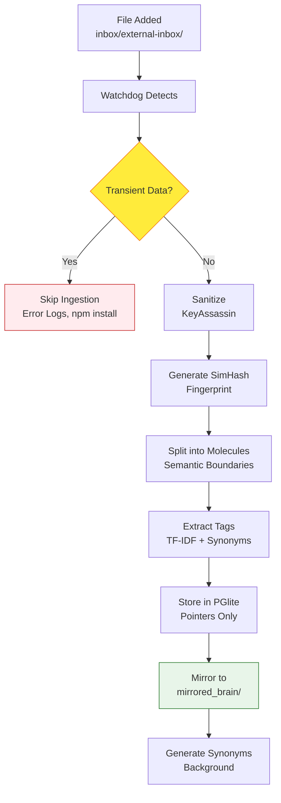

**Transient Filter Patterns:**
- Terminal error logs (Traceback, KeyError)
- Package installation (npm install, pip install)
- Build artifacts (Build succeeded, Compiling...)

---

## Phoenix Protocol: Backup/Restore

```mermaid
flowchart TB
    subgraph BACKUP["Backup Process"]
        A[User: 💾 Eject Memory]
        B[Export Database<br/>atoms, sources, engrams]
        C[Aggregate by Source]
        D[Write JSON<br/>backups/backup_TIMESTAMP.json]
    end

    subgraph RESTORE["Restore Process"]
        E[User: Select Backup]
        F[Wipe Database<br/>Clean Slate]
        G[Restore Tables<br/>atoms, sources, engrams]
        H[Rebuild Filesystem<br/>inbox/, external-inbox/]
        I[Verify Integrity<br/>Count Match]
    end

    A --> B --> C --> D
    E --> F --> G --> H --> I

    style BACKUP fill:#e3f2fd,stroke:#1976d2
    style RESTORE fill:#fff3e0,stroke:#f57f17
    style H fill:#ffeb3b,stroke:#f57f17
```

**Key Feature:** Rebuilds **both** database AND filesystem structure from backup.

---

## Memory Management

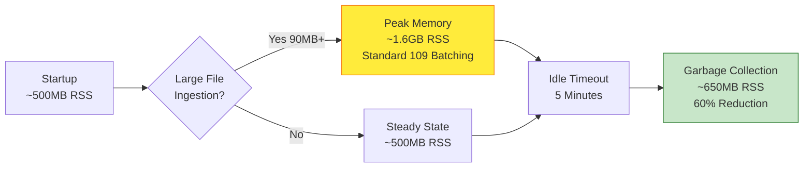

**Standard 109 Batching Benefits:**
- No hangs on 90MB+ files
- Progress logging every 5%
- Event loop yielding prevents UI freezing
- Automatic garbage collection hints

---

## Performance Benchmarks

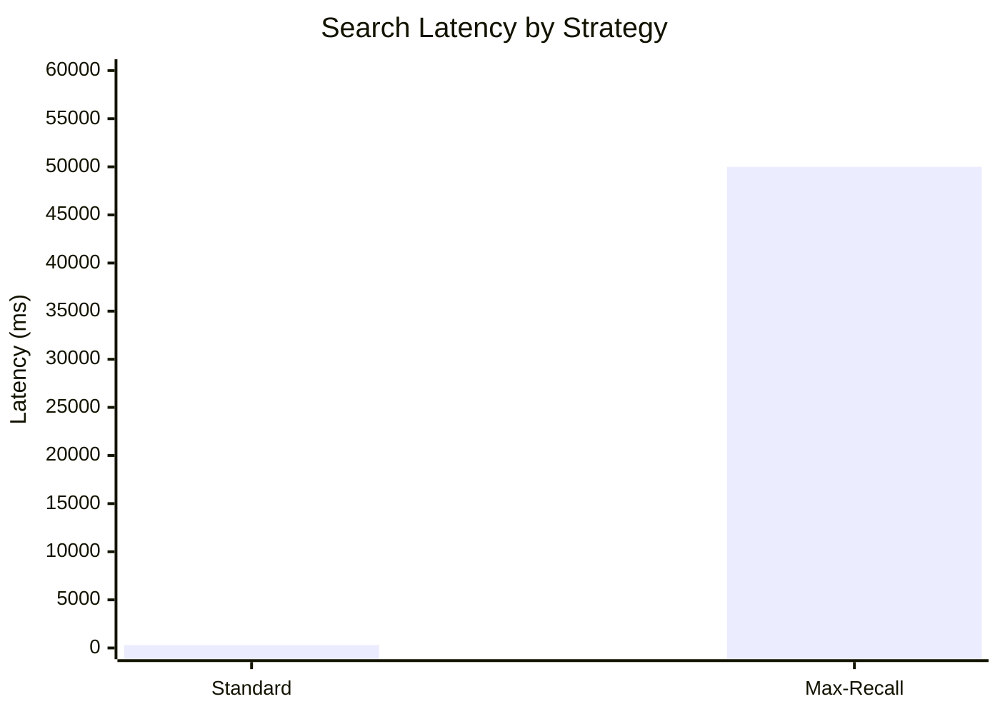

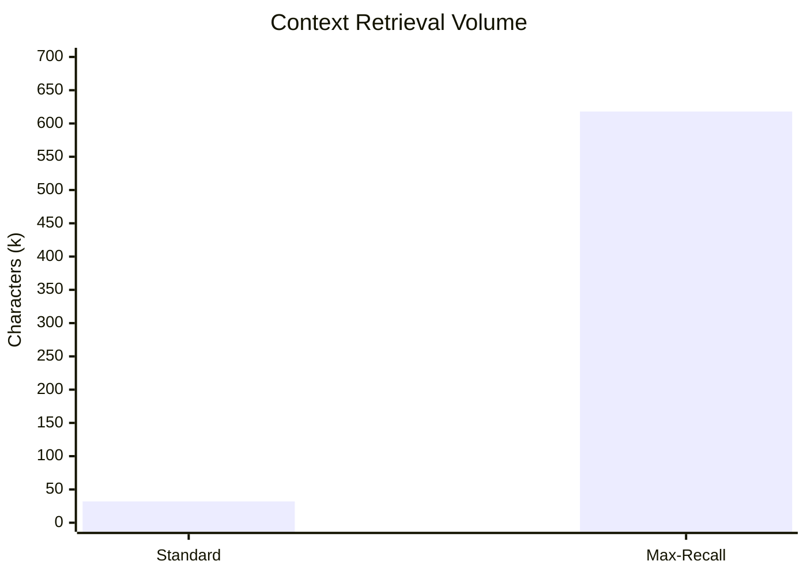

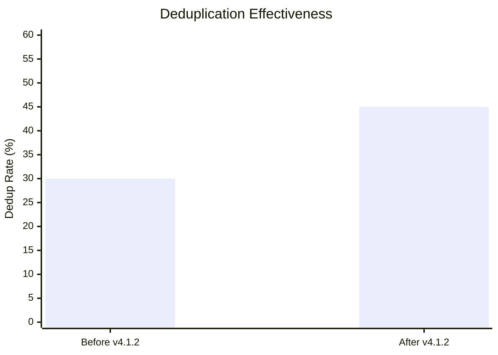

---

## See Also

- **specs/spec.md** - Technical specification (LLM-optimized)
- **docs/whitepaper.md** - STAR Algorithm whitepaper
- **specs/standards/STANDARD_117_ARXIV_SUBMISSION.md** - arXiv submission workflow
- **specs/standards/RESEARCH_LANDSCAPE.md** - Related work analysis

---

**Repository:** https://github.com/RSBalchII/anchor-engine-node  
**License:** AGPL-3.0  
**Production Verified:** February 23, 2026
