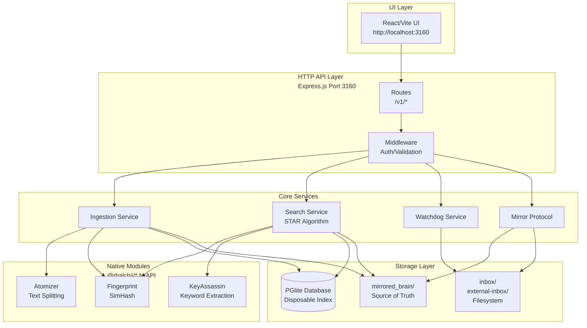
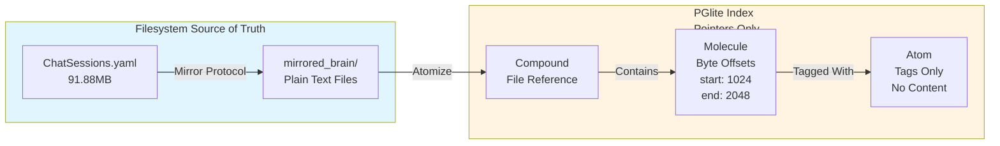
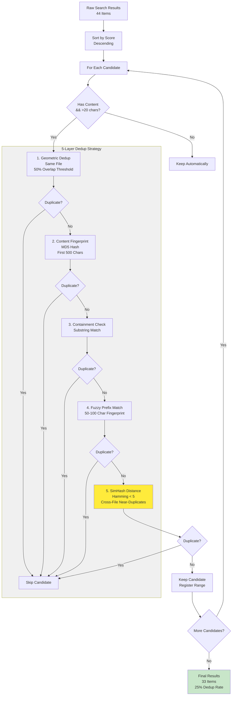
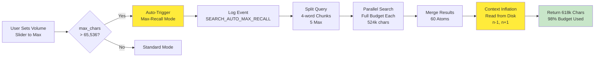
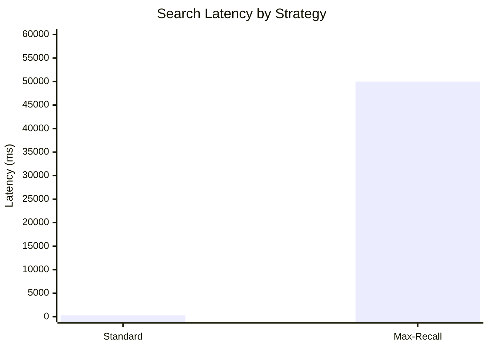
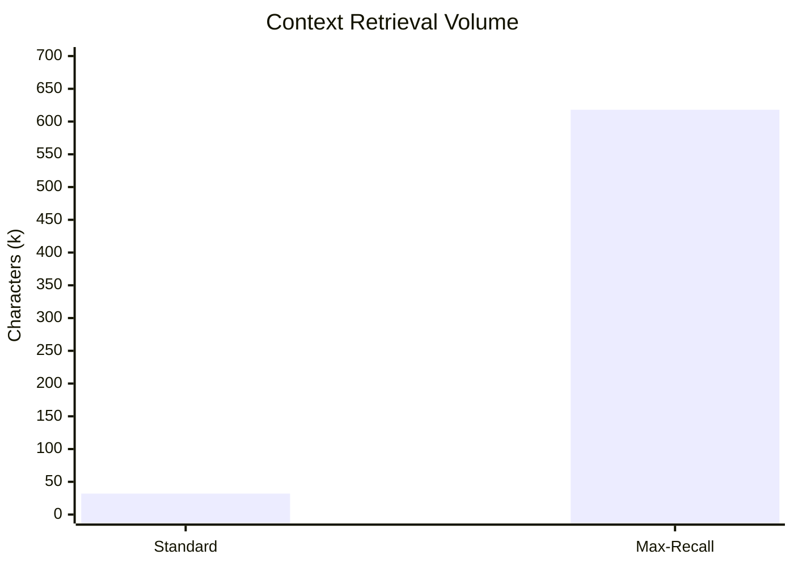
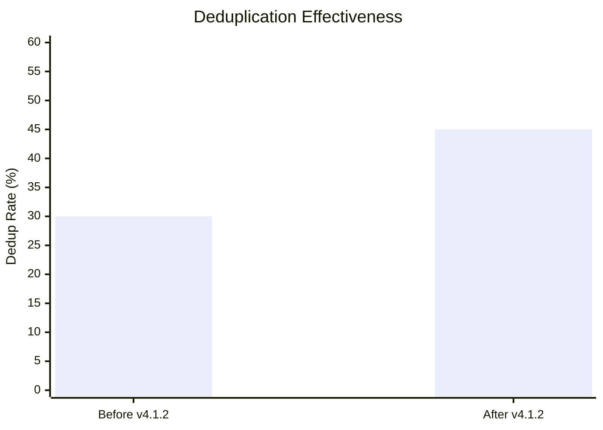
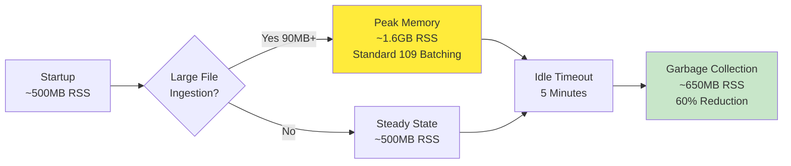

# Anchor Engine - Architecture Diagrams

**Version:** 4.1.2 | **Updated:** February 22, 2026 | **Status:** ✅ Production Ready

---

## System Overview



---

## Data Model: Compound → Molecule → Atom



**Key Insight:** Database is **disposable**. Content lives in `mirrored_brain/`. Database stores byte-offset pointers only.

---

## STAR Search Algorithm Flow

```mermaid
flowchart TB
    A[User Query<br/>"Coda C-001 Rob Dory"] --> B{Budget Check<br/>max_chars > 65k?}
    
    B -->|No| C[Standard Search<br/>70/30 Budget<br/>1-hop<br/>Temporal Decay]
    B -->|Yes| D[Max-Recall Search<br/>Zero Decay<br/>3-hop<br/>200 nodes/hop]
    
    C --> E[Query Parsing<br/>NLP + Key Terms]
    D --> E
    
    E --> F[Parallel Searches<br/>5 Sub-queries<br/>4-word chunks]
    
    F --> G[Merge & Deduplicate<br/>60 Atoms]
    
    G --> H{Max-Recall?}
    H -->|Yes| I[Context Inflation<br/>n-1, n+1 from Disk<br/>8,550 chars/atom]
    H -->|No| J[Return Results<br/>16k-32k chars]
    
    I --> K[Serialize Context<br/>512k-618k chars]
    J --> K
    
    K --> L[Return to User]

    style D fill:#ffeb3b
    style I fill:#ffeb3b
    style K fill:#c8e6c9
```

---

## Deduplication Pipeline (v4.1.2)



### Dedup Layer Details

| Layer | Catches | Example |
|-------|---------|---------|
| **1. Geometric** | Same-file overlapping windows | Molecule A: bytes 100-200, Molecule B: bytes 150-250 → 50% overlap |
| **2. Content Fingerprint** | Cross-file exact duplicates | Same paragraph exported to multiple files |
| **3. Containment** | One result is subset of another | Full document vs. excerpt |
| **4. Fuzzy Prefix** | Near-exact with whitespace/timestamp diffs | Same content, different formatting |
| **5. SimHash Distance** | Cross-file near-duplicates ⭐ **NEW** | Paraphrased versions, modified quotes |

---

## Max-Recall Auto-Trigger Flow



---

## Phoenix Protocol Backup/Restore

```mermaid
flowchart TB
    subgraph BACKUP["Backup Process"]
        A[User Clicks<br/>💾 Eject Memory]
        B[Export Database<br/>atoms, sources, engrams]
        C[Aggregate Content<br/>Group by Source]
        D[Write JSON<br/>backups/backup_TIMESTAMP.json]
    end

    subgraph RESTORE["Restore Process<br/>Phoenix Protocol"]
        E[User Selects<br/>Backup File]
        F[Wipe Database<br/>Clean Slate]
        G[Restore Tables<br/>atoms, sources, engrams]
        H[Rebuild Filesystem<br/>inbox/, external-inbox/]
        I[Verify Integrity<br/>Count Match]
    end

    A --> B
    B --> C
    C --> D
    
    E --> F
    F --> G
    G --> H
    H --> I

    style BACKUP fill:#e3f2fd
    style RESTORE fill:#fff3e0
    style H fill:#ffeb3b
```



**Key Feature:** Phoenix Protocol rebuilds **both** database AND filesystem structure from backup.

---

## Context Inflation: n-1, n+1 Expansion

```mermaid
flowchart LR
    subgraph BEFORE["Before Inflation<br/>60 Atoms × 222 chars<br/>= 13k chars Total"]
        A["Match Point<br/>\"Rob Dory\"<br/>222 chars"]
    end

    subgraph INFLATE["Inflation Process"]
        B[Read Full File<br/>from mirrored_brain/]
        C[Extract ±7,864 chars<br/>Around Match Point]
        D[Replace Atom Content<br/>With Expanded Context]
    end

    subgraph AFTER["After Inflation<br/>60 Atoms × 8,550 chars<br/>= 513k chars Total"]
        E["Full Context<br/>Paragraphs Before/After<br/>8,550 chars"]
    end

    A --> B
    B --> C
    C --> D
    D --> E

    style BEFORE fill:#ffebee
    style INFLATE fill:#f0f0f0
    style AFTER fill:#c8e6c9
    style E fill:#4caf50,color:#fff
```

---

## Unified Field Equation

```
Gravity(atom, anchor) = α × (C × e^(-λΔt) × (1 - d/64))

Where:
  α (Alpha)     = Damping factor (0.85 standard, 1.0 max-recall)
  C             = Co-occurrence (shared tags via SQL JOIN)
  e^(-λΔt)      = Temporal decay (λ=0.00001 standard, 0.0 max-recall)
  d             = SimHash Hamming distance (0-64 bits)
  (1 - d/64)    = SimHash gravity (1.0 = identical, 0.0 = orthogonal)
```

### Parameter Comparison

| Parameter | Standard | Max-Recall | Impact |
|-----------|----------|------------|--------|
| **α (Damping)** | 0.85 | 1.0 | Zero signal loss on multi-hop |
| **λ (Decay)** | 0.00001 | 0.0 | Age irrelevant in max-recall |
| **Max Hops** | 1 | 3 | 3× deeper graph traversal |
| **Max/Hop** | 50 | 200 | 4× more nodes per hop |
| **Temperature** | 0.2 | 0.8 | 4× more serendipitous |

---

## Performance Benchmarks (v4.1.2)







---

## Memory Management



---

## File Locations

| Component | Path | Purpose |
|-----------|------|---------|
| **UI** | `packages/anchor-ui/dist/` | React frontend |
| **Engine** | `engine/dist/` | Compiled TypeScript |
| **Database** | `engine/context_data/` | PGlite files (disposable) |
| **Mirror** | `mirrored_brain/` | Source of truth (gitignored) |
| **Inbox** | `inbox/`, `external-inbox/` | Ingestion sources |
| **Backups** | `backups/` | Phoenix Protocol backups |
| **Standards** | `docs/standards/` | Architecture specs |

---

## Standards Index

| # | Name | File | Status |
|---|------|------|--------|
| **086** | Dual-Strategy Search | STANDARD_086_DUAL_STRATEGY_SEARCH.md | ✅ v2.0 (SimHash Dedup) |
| **113** | Automatic Max-Recall | STANDARD_113_AUTOMATIC_MAX_RECALL.md | ✅ v1.0 |
| **116** | Phoenix Protocol | STANDARD_116_PHOENIX_PROTOCOL.md | ✅ v1.0 |
| **110** | Ephemeral Index | specs/standards/110-ephemeral-index.md | ✅ v1.0 |
| **109** | Batched Ingestion | specs/standards/109-batched-ingestion.md | ✅ v1.0 |
| **104** | Universal Semantic Search | specs/standards/104-universal-semantic-search.md | ✅ v1.0 |

---

**Repository:** https://github.com/RSBalchII/anchor-engine-node  
**License:** AGPL-3.0  
**Production Verified:** February 22, 2026
