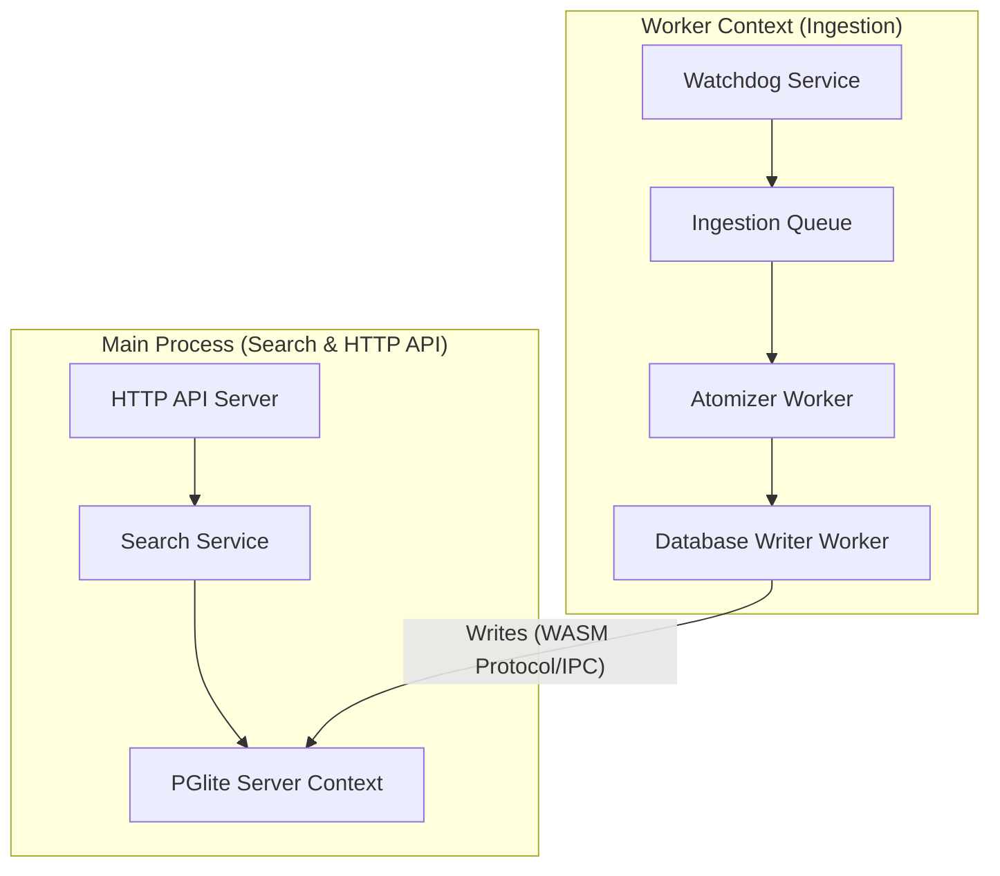

# Process Pipeline Refactor: Isolated Ingestion & Search

This document outlines architectural proposals for separating the ingestion pipeline and the search service into isolated processes or cooperative execution contexts.

## Problem Statement
Currently, both the HTTP API (serving search, distill, and query endpoints) and the Watchdog File Ingest service run on the same Node.js main thread, sharing a single event loop and heap memory. 
Because PGlite is compiled to WebAssembly and runs in-memory on the same thread, long-running CPU-intensive tasks (e.g., AST parsing large codebases, atomizing massive JSON objects like `conversations.json`, and bulk SQL inserts) block the event loop. This leads to:
1. **Search Request Starvation**: Search queries hang for seconds or minutes while ingestion is active.
2. **Memory Contention**: Ingestion of large datasets causes high heap memory pressure, leading to garbage collection spikes or OOM crashes, affecting the availability of search services.
3. **Co-location Bottleneck**: Inability to scale search independent of ingestion pipelines.

---

## Architectural Proposal

---

## Proposals

### Proposal 1: Client/Server Model with PGlite Socket Interface (Recommended)
Host the PGlite instance inside the main API process, exposing a lightweight TCP or WebSocket Postgres-compatible wire interface. Ingestion runs in a completely separate child process or worker thread, communicating with the database over localhost network or IPC.

* **Pros**: 
  - Offloads the Watchdog and CPU-heavy Atomizer (AST parsing, cleaning) to a separate OS thread or process.
  - Zero changes to PGlite's in-memory storage layout.
  - Ingestion processes can crash or restart without taking down the search API.
* **Cons**:
  - Requires writing or configuring a database socket handler to accept remote writes.

### Proposal 2: Shared Disk-backed Database (WAL Mode)
Shift from a purely in-memory PGlite instance to a persistent, disk-backed PGlite/SQLite DB utilizing Write-Ahead Logging (WAL). Multiple processes (Main Process for Search, Ingestion Process for Watchdog) open connections to the same database file on disk.

* **Pros**:
  - Native SQLite/Postgres locking handles concurrency safely.
  - Highly standard shared-nothing multi-process architecture.
  - Search can read from the WAL log while Ingestion is actively writing to the database.
* **Cons**:
  - Marginally higher I/O overhead compared to pure in-memory memory heaps.

### Proposal 3: Message-Queue and Worker Threads (Intra-process isolation)
Maintain a single process, but spin up Node `worker_threads` for CPU-bound parts of the ingestion pipeline (Atomizer, AST Parser, Content Cleaners). Use an in-memory queue to coordinate and throttle ingestion.

* **Pros**:
  - Easiest to implement without changing how PGlite is hosted.
  - Worker threads natively share memory or communicate using high-performance ArrayBuffers.
* **Cons**:
  - Still shares the parent process memory pool; an Out-Of-Memory (OOM) error in the worker could potentially crash the entire process.

---

## Next Steps and Implementation Milestones

1. **Phase 1: Ingestion Throttling and Chunking (Done)**: Chunk large files at the Watchdog boundary to prevent memory spikes, and yield to the event loop between chunks.
2. **Phase 2: Offload Atomizer to Worker Thread**: Migrate `AtomizerService.atomize()` call inside `processFile` to run on a background `worker_threads` instance, passing results back to the main thread for insertion.
3. **Phase 3: Relocate database to persistent SQLite/WAL**: Convert database connection to a shared SQLite database file on disk so the watchdog can run in a completely independent Node.js process.
