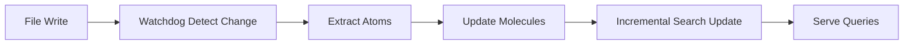

# Ideas for Future Workflow Automation

## Proposed Features

### 1. Auto-Open Browser on Startup

**Current:** User must manually navigate to `http://localhost:3160/search` after starting the engine.

**Proposed:** Automatically open browser and load search page when server starts.

```javascript
// In engine/src/index.ts or startup script
server.listen(PORT, async () => {
  console.log(`Server running on port ${PORT}`);
  
  // Auto-open browser (macOS/Linux)
  if (process.platform !== 'win32') {
    const { exec } = require('child_process');
    exec(`open http://localhost:${PORT}/search`);
  } else {
    // Windows
    const { spawn } = require('child_process');
    spawn('start', ['http://localhost:3160/search'], { detached: true });
  }
});
```

**Considerations:**
- User may not want browser to auto-start (privacy, distraction)
- Should be configurable via `user_settings.json`
- Respect user preference for manual launch

---

### 2. VS Code Integration / Auto-Detect Workspace

**Current:** User must manually add project path in the GUI.

**Proposed:** Detect active VS Code workspace and auto-add to watch list.

```javascript
// On engine startup, check if launched from VS Code
const { env } = process;
if (env.VSCODE_CWD && env.VSCODE_PID) {
  // Add env.VSCODE_CWD to watched paths automatically
}
```

**Alternative:** VS Code extension that:
- Watches for Anchor Engine running on localhost:3160
- Automatically adds current workspace folder to watch list
- Shows engine status in Status Bar
- Provides "Start Watchdog" command

---

### 3. Incremental Index Correction

**Current:** Database rebuilds from scratch on startup (ephemeral design).

**Proposed:** Track file changes incrementally and update index as you code.



**Benefits:**
- No rebuild needed when editing a single file
- Instant search updates as you type
- Lower resource usage during development sessions

**Challenges:**
- Maintaining consistency with atomic transactions
- Handling deleted files and content removals
- Managing provenance chain updates

---

### 4. Project-Specific Context Awareness

**Current:** All data goes into a single database.

**Proposed:** Automatically detect multiple projects in workspace and create separate contexts.

```javascript
// Example structure:
~/.anchor/notebook/
├── project-a/      # Files from .qwenpaw/workspaces/P1/coding_projects/myapp
├── project-b/      # Files from .qwenpaw/workspaces/P2/coding_projects/api-server  
└── shared/         # Shared context (if any)

user_settings.json:
{
  "paths": {
    "notebook": "~/.anchor/notebook",
    "contexts": {
      "project-a": "~/coding_projects/myapp",
      "project-b": "~/coding_projects/api-server"
    }
  }
}
```

**UI Implications:**
- Add "Switch Context" dropdown in search UI
- Different color coding for different projects
- Ability to run watchdog per-context

---

### 5. Incremental Corpus Backup

**Current:** Full corpus backup exports all molecules as YAML (takes time, requires I/O).

**Proposed:** Delta backups that only export changed records since last backup.

```json
{
  "incremental_backup": {
    "last_full_backup": "2026-06-07T10:00:00Z",
    "changes_since": {
      "added": ["atom_abc123", "molecule_def456"],
      "modified": ["atom_ghi789"],
      "deleted": []
    },
    "checksums": { ... }
  }
}
```

**Restore Process:**
- Full backup provides base snapshot
- Incremental backups apply deltas in order
- Much faster than full export for frequent backups

---

### 6. Live Preview Pane

**Current:** Search results require clicking to view full context.

**Proposed:** Side panel showing expanded molecule/atom content as you search.

```mermaid
block-beta
    column1: Search Results List
    column2: Context Expansion Area
    
    block:Result[Result Item]
        direction LR
        title["Record Title"]
        preview["Content Preview..."]
        expand[Expand ↗]
    end
    
    Result --> expand --> context[Full Atom Content]
```

**Implementation:**
- Add "Expand" button to search results
- Show full atom/molecule text in right panel
- Support nested expansion (show related atoms)

---

### 7. Smart Tag Suggestions

**Current:** Tags must be manually assigned during ingestion.

**Proposed:** Auto-suggest tags based on content analysis.

```javascript
// Example logic:
const analyzeTags = async (content: string) => {
  const techStack = ['typescript', 'nodejs', 'react', 'docker'];
  const keywords = techStack.filter(t => 
    content.toLowerCase().includes(t)
  );
  
  return [...new Set(keywords)]; // Deduplicate
};
```

**Benefits:**
- Better searchability without manual effort
- Consistent tagging across corpus
- Can be overridden by user if needed

---

## Priority Order

1. **Incremental Index Correction** — highest impact for developer experience
2. **VS Code Integration** — removes friction from setup
3. **Auto-Open Browser** — convenience feature (low effort, high value)
4. **Project Context Awareness** — enables multi-project workflows
5. **Live Preview Pane** — improves search UX
6. **Incremental Backups** — complements full backup system

---

## Implementation Notes

### Data Migration Path
When implementing incremental features:
- Keep existing ephemeral database design
- Add `last_updated_at` column to atoms/molecules tables
- Track change timestamps for delta detection

### Performance Considerations
- Incremental updates should be <100ms per file
- Avoid blocking UI during ingestion
- Use background workers for heavy operations

### Testing Strategy
- Create "live-fire" test suite that:
  - Writes test files
  - Verifies immediate search availability
  - Checks provenance chain integrity