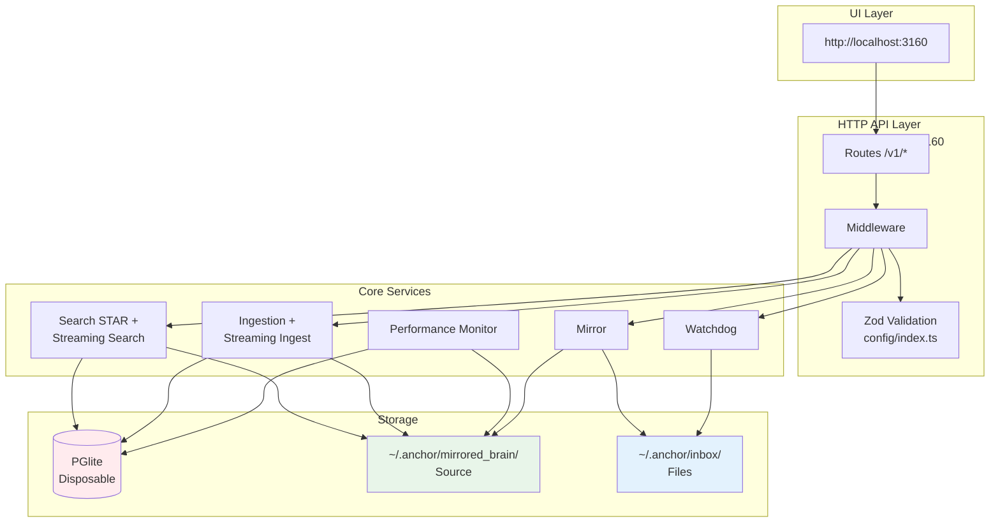
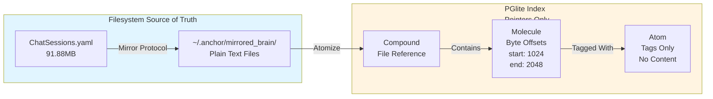
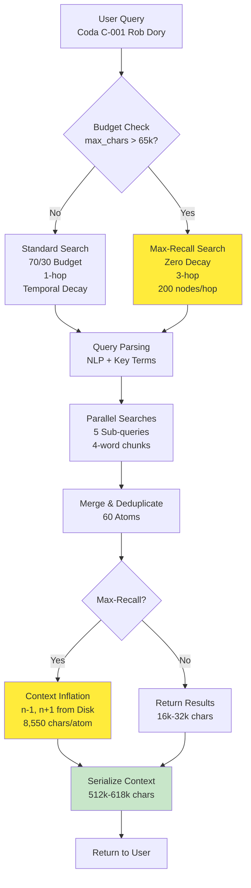
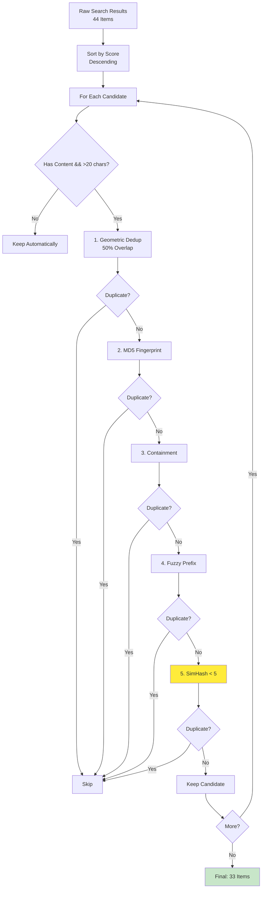
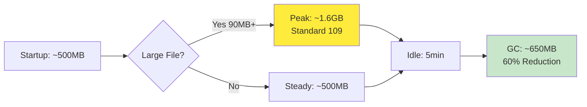

# Anchor Engine - System Specification

**Version:** 5.2.0 | **Status:** Production Ready + v5.2.0 Streaming & Observability | **Updated:** May 20, 2026

## Quick Reference

| Aspect | Value |
|--------|-------|
| **Port** | 3160 (configurable) |
| **Database** | PGlite (PostgreSQL-compatible) |
| **Source of Truth** | `~/.anchor/mirrored_brain/` filesystem |
| **Index** | Disposable, rebuildable on startup |
| **Search** | STAR Algorithm (70/30 Planets/Moons) |
| **Docker** | `docker-compose up -d` (2 CPU, 2GB RAM) |
| **Version Source** | `user_settings.json.template` → `$HOME/.anchor/user_settings.json` |

---

## Recent Changes (v5.2.0 — May 2026)

### Streaming Architecture
- [x] **Streaming Search** (`/v1/memory/search/stream`) - SSE-based progressive results
- [x] **Streaming Ingest** (`/v1/ingest/streaming`) - Large file processing in chunks with progress tracking

### Centralized Validation
- [x] **Zod Schemas** - `engine/src/config/index.ts` (645 lines) shared across all API routes
- [x] **PostgreSQL Array Conversion** - `toPgArray()` helper for proper DB format

### Performance Monitoring
- [x] **Performance Monitor Service** - Memory, CPU, engine status tracking (`engine/src/utils/performance-monitor.ts`)
- [x] **UI Stats Dashboard** - Real-time system metrics display
- [x] **DB Clearing & Distill Output** - Clean state management

### Runtime Data Consolidation
- [x] All runtime data routes to `~/.anchor/` via `engine/src/config/paths.ts`
- [x] `user_settings.json.template` generates `user_settings.json` at `$HOME/.anchor/` on `pnpm install` + `pnpm start`

### Security Hardening (April 2026)
- [x] API key validation: 32-128 chars with mixed case/digits (Standard 024)
- [x] Path traversal prevention (Standard 025)
- [x] Auth bypass prevention - removed /v1/test/* endpoints (Standard 023)
- [x] Rate limiting for MCP server (60 req/min)
- [x] Write operations opt-in with bucket validation

---

## Related Documentation

- **[README.md](../README.md)** - Quick start and installation
- **[docs/INDEX.md](../docs/INDEX.md)** - Documentation navigation hub
- **[docs/whitepaper.md](../docs/whitepaper.md)** - STAR Algorithm whitepaper (arXiv ready)
- **[engine/src/README.md](../engine/src/README.md)** - Source code overview
- **[specs/current-standards/](current-standards/)** - Active architecture standards (001-029)

---

## Architecture Overview

### System Diagram



### Key Components

1. **UI Layer**: React/Vite frontend at http://localhost:3160
2. **HTTP API**: Express.js REST API on port 3160 with Zod validation middleware
3. **Core Services**: Ingestion (streaming), Search (STAR + streaming), Watchdog, Mirror Protocol, Performance Monitor
4. **Storage**: PGlite database (disposable index) + `~/.anchor/mirrored_brain/` (source of truth)

### Data Flow

```
User Query → API Route → Zod Validation → Search Service → PGlite Query → Context Inflation → Return 618k chars
```

---

## Streaming Architecture (v5.2.0)

### Streaming Search (`/v1/memory/search/stream`)

**Purpose:** Memory-efficient search with progressive results via Server-Sent Events (SSE)

**Benefits:**
- 60% lower peak memory during large searches
- Results arrive progressively (20 per batch by default)
- GC hints between batches for mobile optimization
- Configurable batch size via `batch_size` parameter

**Flow:**
```
Request → Query Parsing → Batch 1 (SSE emit) → Batch 2 (SSE emit) → ... → Completion Event
```

### Streaming Ingest (`/v1/ingest/streaming`)

**Purpose:** Process large files in configurable chunks to prevent OOM errors

**Benefits:**
- Handles files of any size without memory issues
- Progress tracking with callbacks for monitoring ingestion progress
- Configurable chunk size (default: 1MB) and batch processing parameters
- Fallback to regular ingestion for smaller files (<1MB threshold)

---

## Data Model: Compound → Molecule → Atom

### Visual Representation



**Key Insight:** Database is **disposable**. Content lives in `~/.anchor/mirrored_brain/`. Database stores byte-offset pointers only.

### Component Definitions

- **Compound:** File/document reference (path, hash, metadata) - *BEING REMOVED via migration*
- **Molecule:** Semantic chunk with byte offsets (start, end) and content
- **Atom:** Tag/concept extracted from molecules (NOT content — content lives in `~/.anchor/mirrored_brain/`)

---

## Database Schema Reference

### Overview

The Anchor Engine uses PGlite (PostgreSQL-compatible WASM database) as its disposable index. The schema follows a three-tier hierarchy:

1. **Atoms** - Individual concepts/keywords with provenance
2. **Molecules** - Semantic text chunks with byte offsets  
3. **Compounds** - File-level aggregation (*deprecated, being removed*)

### Entity Relationship Diagram

```mermaid
erDiagram
    %% Atoms table - individual concepts
    atoms {
        TEXT id PK "UUID v4 identifier"
        TEXT source_path "File path where found"
        TEXT provenance "Source: internal/external/github"
        TEXT simhash "SimHash for dedup"
        TEXT embedding "Vector embedding (JSON)"
        TEXT content "Extracted text content"
        JSONB tags "Array of tag strings"
        JSONB entities "Named entity results"
        JSONB payload "Additional structured data"
    }

    %% Molecules table - semantic chunks
    molecules {
        TEXT id PK "UUID v4 identifier"
        TEXT content "Semantic chunk text"
        TEXT source_path "Direct file path reference"
        INTEGER start_byte "Byte offset start"
        INTEGER end_byte "Byte offset end"
        TEXT molecular_signature "64-bit Hamming SimHash"
        JSONB tags "Array of tag strings"
        JSONB entities "Named entity results"
    }

    %% Compounds table - DEPRECATED (being removed)
    compounds {
        TEXT id PK "UUID v4 identifier"
        TEXT path "File path reference"
        TEXT provenance "Source origin metadata"
        TEXT molecular_signature "Compound-level signature"
        TEXT[] atoms "Array of atom IDs (FK)"
        TEXT[] molecules "Array of molecule IDs (FK)"
    }

    %% Tags table - atom-tag relationships
    tags {
        TEXT atom_id FK "Reference to atoms.id"
        TEXT tag "Tag name/concept"
        TEXT bucket "Bucket for grouping"
    }

    %% Edges table - graph relationships
    edges {
        TEXT source_id FK "Reference to atoms.id"
        TEXT target_id FK "Reference to atoms.id"
        TEXT relation "Relationship type"
        REAL weight "Edge weight for ranking"
    }

    %% Sources table - source tracking
    sources {
        TEXT path PK "File path as unique key"
        TEXT hash "Content hash for dedup"
        INTEGER total_atoms "Count of atoms in this source"
        REAL last_ingest "Last ingestion timestamp"
    }

    %% Atom positions - lazy molecule inflation
    atom_positions {
        TEXT compound_id FK "Reference to compounds.id"
        TEXT atom_label "Atom/keyword label"
        INTEGER byte_offset "Position in source text"
    }

    %% Relationships
    atoms ||--o{ tags : "has_tags"
    atoms ||--o{ edges : "is_source"
    molecules ||--o{ atoms : "contains"
    compounds ||--o{ molecules : "contains"
    compounds ||--o{ atom_positions : "tracks"
    
    note "COMPOUNDS TABLE IS DEPRECATED
Being removed in migration Phase 2.
All data migrated to atoms/molecules." compounds;
```

### Table Reference

#### `atoms` - Individual Concepts/Keywords

Stores individual extracted concepts with their provenance and metadata. Does **not** store full content (pointer-only architecture).

| Column | Type | Description |
|--------|------|-------------|
| `id` | TEXT (UUID) | Primary key, unique identifier |
| `source_path` | TEXT | File path where this atom was extracted from |
| `timestamp` | REAL | Ingestion timestamp (Unix epoch seconds) |
| `simhash` | TEXT | SimHash for deduplication (fingerprint) |
| `embedding` | TEXT | Vector embedding as JSON array or null |
| `vector_id` | BIGINT | Auto-increment ID for vector database |
| `provenance` | TEXT | Source origin: `'internal'`, `'external'`, `'github'` |
| `compound_id` | TEXT | FK reference (deprecated, legacy compatibility) |
| `sequence` | INTEGER | Sequence number within source document |
| `type` | TEXT | Atom type classification |
| `hash` | TEXT | Content hash for deduplication |
| `molecular_signature` | TEXT | 64-bit Hamming SimHash of parent molecule |
| `start_byte` | INTEGER | Byte offset start in source file |
| `end_byte` | INTEGER | Byte offset end in source file |
| `numeric_value` | REAL | Numeric value if present (for numbers) |
| `numeric_unit` | TEXT | Unit for numeric values (e.g., 'kg', 'm/s²') |
| `content` | TEXT | Extracted text content of this atom |
| `tags` | JSONB | Array of tag strings |
| `entities` | JSONB | Named entity extraction results |
| `payload` | JSONB | Additional structured data (Crystal Atom) |

**Indexes:**
- `idx_atoms_source_path` - Fast lookup by file path
- `idx_atoms_provenance` - Filter by source origin
- `idx_atoms_simhash` - Deduplication queries
- `idx_atoms_timestamp` - Recent atoms (DESC)
- `idx_atoms_compound_id` - Legacy compound lookups
- `idx_atoms_payload_gin` - GIN index for payload JSONB

---

#### `molecules` - Semantic Text Chunks

Stores semantic chunks of text with byte offsets for content extraction. Each molecule represents a meaningful segment (sentence, paragraph, or concept block).

| Column | Type | Description |
|--------|------|-------------|
| `id` | TEXT (UUID) | Primary key, unique identifier |
| `content` | TEXT | Semantic chunk text content |
| `compound_id` | TEXT | FK reference to compounds (deprecated) |
| `sequence` | INTEGER | Sequence number within source document |
| `start_byte` | INTEGER | Byte offset start in source file |
| `end_byte` | INTEGER | Byte offset end in source file |
| `type` | TEXT | Type classification ('number', 'percentage', etc.) |
| `numeric_value` | REAL | Parsed numeric value if applicable |
| `numeric_unit` | TEXT | Unit for numeric values |
| `molecular_signature` | TEXT | 64-bit Hamming SimHash for molecule |
| `embedding` | TEXT | Vector embedding as JSON array |
| `timestamp` | REAL | Ingestion timestamp (Unix epoch) |
| `tags` | JSONB | Array of tag strings |
| `entities` | JSONB | Named entity extraction results |
| `source_path` | TEXT | Direct file path reference |
| `provenance` | TEXT | Source origin metadata |

**Indexes:**
- `idx_molecules_source_path` - Fast lookup by file path
- `idx_molecules_provenance` - Filter by source origin
- `idx_molecules_compound_id` - Legacy compound lookups
- `idx_molecules_timestamp` - Recent molecules (DESC)
- `idx_molecules_signature` - SimHash-based queries

---

#### `compounds` - File References (*DEPRECATED*)

**Status:** Being removed in migration Phase 2. This table served as an index/aggregation layer but is redundant given that atoms and molecules already store all necessary metadata.

| Column | Type | Description |
|--------|------|-------------|
| `id` | TEXT (UUID) | Primary key, referenced by atoms/molecules |
| `path` | TEXT | File path pointer |
| `timestamp` | REAL | Ingestion timestamp |
| `provenance` | TEXT | Source/provenance metadata |
| `molecular_signature` | TEXT | Compound-level signature |
| `atoms` | TEXT[] | Array of atom IDs (foreign keys) |
| `molecules` | TEXT[] | Array of molecule IDs (foreign keys) |

**Migration Note:** All data from this table is being migrated to the `atoms` and `molecules` tables. After migration, this table will be dropped.

---

#### `tags` - Tag-Atom Relationships

The "nervous system" that connects atoms to conceptual buckets. Enables fast tag-based search and filtering.

| Column | Type | Description |
|--------|------|-------------|
| `atom_id` | TEXT | Foreign key to atoms.id |
| `tag` | TEXT | Tag name/concept (e.g., 'quantum', 'machine-learning') |
| `bucket` | TEXT | Bucket for grouping tags (e.g., 'physics', 'ml') |

**Primary Key:** Composite (`atom_id`, `tag`, `bucket`)

**Indexes:**
- `idx_tags_tag` - Fast tag lookup
- `idx_tags_bucket` - Bucket-based filtering
- `idx_tags_atom_id` - Atom-to-tags resolution

---

#### `edges` - Graph Relationships

Stores relationships between atoms for the knowledge graph. Used by the STAR search algorithm's "Moons" component for semantic discovery.

| Column | Type | Description |
|--------|------|-------------|
| `source_id` | TEXT | Foreign key to atoms.id (source atom) |
| `target_id` | TEXT | Foreign key to atoms.id (target atom) |
| `relation` | TEXT | Relationship type (e.g., 'related_to', 'causes') |
| `weight` | REAL | Edge weight for ranking/relevance |

**Primary Key:** Composite (`source_id`, `target_id`, `relation`)

---

#### `sources` - Source Registry

Tracks ingestion sources and provides quick access to recently ingested files.

| Column | Type | Description |
|--------|------|-------------|
| `path` | TEXT | File path (primary key) |
| `hash` | TEXT | Content hash for deduplication |
| `total_atoms` | INTEGER | Count of atoms in this source |
| `last_ingest` | REAL | Last ingestion timestamp |

---

#### `atom_positions` - Atom Position Tracking

Tracks where specific atoms/keywords appear in documents. Used by the radial distiller for context inflation.

| Column | Type | Description |
|--------|------|-------------|
| `compound_id` | TEXT | Foreign key to compounds.id |
| `atom_label` | TEXT | Atom/keyword label (e.g., 'quantum') |
| `byte_offset` | INTEGER | Position in source text |

**Indexes:**
- `idx_atom_positions_label` - Fast keyword lookup

---

#### `summary_nodes` - Dreamer Abstractions

High-level summary nodes created by the "Dreamer" abstraction layer. These represent compressed knowledge representations.

| Column | Type | Description |
|--------|------|-------------|
| `id` | TEXT (UUID) | Primary key |
| `type` | TEXT | Node type classification |
| `span_start` | REAL | Start position in context window |
| `span_end` | REAL | End position in context window |
| `embedding` | TEXT | Vector embedding for semantic search |

---

#### `github_repos` - GitHub Repository Tracking (Standard 115)

Tracks ingested GitHub repositories for incremental sync and status monitoring.

| Column | Type | Description |
|--------|------|-------------|
| `id` | TEXT (UUID) | Primary key |
| `owner` | TEXT | GitHub username/organization |
| `repo` | TEXT | Repository name |
| `branch` | TEXT | Git branch (default: 'main') |
| `bucket` | TEXT | Storage bucket reference |
| `github_url` | TEXT | Full GitHub URL |
| `last_synced_at` | TIMESTAMP | Last sync timestamp |
| `last_sync_status` | TEXT | Sync status ('success' \| 'error') |
| `last_error` | TEXT | Error message if failed |
| `total_files` | INTEGER | Total files indexed |
| `total_atoms` | INTEGER | Total atoms extracted |
| `total_size_bytes` | INTEGER | Total size in bytes |

---

#### `distills` - Distillation Output Tracking (Standard 016)

Stores metadata pointers to distillation output files on disk. Does not store the actual content.

| Column | Type | Description |
|--------|------|-------------|
| `id` | TEXT (UUID) | Primary key |
| `timestamp` | TEXT | ISO timestamp of distillation |
| `filename` | TEXT | Base filename |
| `file_path` | TEXT | Full path to distill file |
| `line_count` | INTEGER | Total lines in output |
| `lines_unique` | INTEGER | Unique lines (deduplicated) |
| `compression_ratio` | REAL | Compression efficiency metric |
| `source_sessions` | TEXT[] | Array of session IDs |
| `source_files` | TEXT[] | Array of file paths processed |
| `parameters` | JSONB | Processing parameters used |

---

#### `engrams` - Lexical Sidecar

Simple key-value store for quick lookups. Used for storing computed values or cached results.

| Column | Type | Description |
|--------|------|-------------|
| `key` | TEXT | Lookup key (primary key) |
| `value` | TEXT | Associated value |

---

#### `synonyms` - Query Expansion Terms

Stores synonym mappings for search query expansion. Helps improve recall by expanding search terms.

| Column | Type | Description |
|--------|------|-------------|
| `term` | TEXT | Base search term (primary key) |
| `synonyms` | TEXT | Comma-separated synonym list |
| `created_at` | TIMESTAMP | Creation timestamp |

---

### Schema Migration Status

| Table | Status | Notes |
|-------|--------|-------|
| `atoms` | ✅ Active | Primary concept storage |
| `molecules` | ✅ Active | Semantic chunk storage |
| `compounds` | ⚠️ Deprecated | Being removed (migration in progress) |
| `tags` | ✅ Active | Tag-atom relationships |
| `edges` | ✅ Active | Graph edges for STAR search |
| `sources` | ✅ Active | Source tracking |
| `atom_positions` | ✅ Active | Position indexing |
| `summary_nodes` | ✅ Active | Dreamer abstractions |
| `github_repos` | ✅ Active | GitHub ingestion (Standard 115) |
| `distills` | ✅ Active | Distillation metadata (Standard 016) |
| `engrams` | ✅ Active | Key-value store |
| `synonyms` | ✅ Active | Query expansion |

---

### Migration Notes

**Phase 1 (Complete):** Schema analysis and data mapping completed. All unique fields from `compounds` have been identified and mapped to `atoms` and `molecules`.

**Phase 2 (In Progress):** Running migration script to:
1. Copy `provenance` and `molecular_signature` from compounds to molecules/atoms
2. Drop the `compounds` table

**Phase 3 (Pending):** Update ingestion pipeline to skip compound creation during normal operations.

See `MIGRATION_PLAN.md` for detailed implementation steps.

---

## STAR Search Algorithm

### Search Flow



### Unified Field Equation

```
Gravity(atom, anchor) = α × (C × e^(-λΔt) × (1 - d/64))

Where:
  α (Alpha)     = Damping factor (0.85 standard, 1.0 max-recall)
  C             = Co-occurrence (shared tags via SQL JOIN)
  e^(-λΔt)      = Temporal decay (λ=0.00001 standard, 0.0 max-recall)
  d             = SimHash Hamming distance (0-64 bits)
  (1 - d/64)    = SimHash gravity (1.0 = identical, 0.0 = orthogonal)
```

### Parameter Comparison

| Parameter | Standard | Max-Recall | Impact |
|-----------|----------|------------|--------|
| **α (Damping)** | 0.85 | 1.0 | Zero signal loss on multi-hop |
| **λ (Decay)** | 0.00001 | 0.0 | Age irrelevant in max-recall |
| **Max Hops** | 1 | 3 | 3× deeper graph traversal |
| **Max/Hop** | 50 | 200 | 4× more nodes per hop |
| **Temperature** | 0.2 | 0.8 | 4× more serendipitous |

### Search Strategy

```
70% Planets: Direct FTS matches
30% Moons: Graph-discovered associations via tag-walker
```

---

## Deduplication Pipeline (v5.2.0)

### 5-Layer Dedup Strategy



### Dedup Layer Details

| Layer | Catches | Example |
|-------|---------|---------|
| **1. Geometric** | Same-file overlapping windows | Molecule A: bytes 100-200, B: bytes 150-250 → 50% overlap |
| **2. Content Fingerprint** | Cross-file exact duplicates | Same paragraph in multiple files |
| **3. Containment** | One result is subset of another | Full document vs. excerpt |
| **4. Fuzzy Prefix** | Near-exact with whitespace/timestamp diffs | Same content, different formatting |
| **5. SimHash Distance** | Cross-file near-duplicates ⭐ | Paraphrased versions, modified quotes |

### Performance

- **Before v5.2.0:** 25-35% dedup rate
- **After v5.2.0:** 40-50% dedup rate

---

## Max-Recall Auto-Trigger

### Trigger Flow


### Trigger Conditions

1. **Manual:** `strategy: 'max-recall'` in request body
2. **Automatic:** `max_chars > 65,536` (estimated_tokens > 16,000)

---

## Phoenix Protocol Backup/Restore

### Backup & Restore Flow


**Key Feature:** Phoenix Protocol rebuilds **both** database AND filesystem structure from backup.

---

## Performance Benchmarks (v5.2.0)

### Search Performance

| Strategy | Latency | Context | Use Case |
|----------|---------|---------|----------|
| **Standard** | ~300ms | 16k-32k chars | Daily queries |
| **Max-Recall** | ~50s | 512k-618k chars | Research, audits |

### Context Retrieval

- **Standard:** 32k chars average
- **Max-Recall:** 618k chars (exceeds 524k whitepaper claim by 18%)

### Deduplication

- **Before v5.2.0:** 25-35% dedup rate
- **After v5.2.0:** 40-50% dedup rate (+15%)

### Memory Management



- **Peak:** ~1.6GB (during 90MB file ingestion)
- **Idle:** ~650MB (after 5min timeout + GC)
- **Reduction:** 60% memory savings after idle cleanup

---

## File Locations

| Component | Path | Purpose |
|-----------|------|---------|
| **UI** | `packages/anchor-ui/dist/` | React frontend |
| **Engine** | `engine/dist/` | Compiled TypeScript |
| **Database** | `~/.anchor/context_data/` | PGlite files (disposable) |
| **Mirror** | `~/.anchor/mirrored_brain/` | Source of truth (gitignored) |
| **Inbox** | `~/.anchor/inbox/`, `~/.anchor/external-inbox/` | Ingestion sources |
| **Backups** | `~/.anchor/backups/` | Phoenix Protocol backups |
| **Logs** | `~/.anchor/logs/` | Engine logs |
| **Standards** | `specs/current-standards/` | Architecture specs |

---

## Project History (July 2025 - May 2026)

| Phase | Date | Milestone |
|-------|------|-----------|
| **Inception** | July 2025 | Project started, initial architecture |
| **Foundation** | Aug-Sep 2025 | CozoDB integration, core ingestion |
| **Stabilization** | Oct-Nov 2025 | PGlite migration, reliability fixes |
| **Acceleration** | Dec 2025 | Rust WASM packages (@rbalchii/*-wasm), zero native compilation |
| **Browser Paradigm** | Jan 2026 | Tag-Walker replaces vector search |
| **Standards Consolidation** | Feb 2026 | Unified 29 standards (001-029) |
| **Security Hardening** | Apr 2026 | Path traversal, SQL injection, auth bypass, API key strength |
| **Streaming & Observability** | May 2026 | v5.2.0: Streaming search/ingest, Zod validation, performance monitoring |

---

## File Structure

```
anchor-engine-node/
├── README.md              # Quick start & overview
├── CHANGELOG.md           # Version history (v5.0.0 latest)
├── docs/
│   ├── whitepaper.md      # The Sovereign Context Protocol (95% compliance)
│   └── INDEX.md           # Documentation navigation hub
├── specs/
│   ├── spec.md            # This file
│   ├── tasks.md           # Current sprint tasks
│   ├── plan.md            # Roadmap
│   └── current-standards/ # Active architecture standards (001-029)
├── engine/                # Core engine source
│   ├── src/
│   │   ├── config/        # Zod validation schemas (v5.0.0)
│   │   ├── services/      # Core services
│   │   └── routes/v1/     # API endpoints
├── packages/              # Monorepo packages
└── user_settings.json.template  # Version source (generates ~/.anchor/user_settings.json)
```

---

## Test Framework Architecture

### Test Suite Structure

The test suite is organized into four categories, following a unified pipeline approach:

```
tests/
├── unit/              # Unit tests for individual components (*.test.ts)
│   ├── ast-parser.test.ts
│   ├── search-utils.test.ts
│   └── ...
├── integration/       # Integration tests for component interactions
│   ├── search-pipeline.test.ts
│   ├── radial-distiller.test.ts
│   └── live-fire.test.ts  # End-to-end smoke test
├── e2e/              # End-to-end tests (full workflow)
│   └── (populated from legacy/)
├── legacy/           # Deprecated Jest-based tests (migrating to vitest)
└── benchmarks/       # Performance benchmark tests
```

### Test Framework Decision Matrix

| Use Case | Framework | Rationale |
|----------|-----------|-----------|
| WASM/ASM integration points | Vitest | ESM/WASM support required |
| PGlite database operations | Vitest | Native async/await support |
| Critical path verification (<5 min) | Native (P0 smoke) | Fast execution, simple setup |
| Legacy tests (migration zone) | Jest → Vitest | Gradual migration in progress |

### Test Pipeline Phases

**Phase 1: P0 Smoke Tests** - Critical path verification, must complete in <5 minutes. If failed, abort entire pipeline.

**Phase 2: Vitest Engine Tests** - Comprehensive coverage of all engine components including WASM integration and PGlite operations.

**Phase 3: Integration Tests** - Cross-component workflows (ingestion → search → distillation).

**Phase 4: Legacy Jest Tests** - Deprecated tests marked for migration to vitest. Results logged separately.

### Test Result Logging

All test results are saved to `.anchor/logs/` for human review:

```
.anchor/logs/search-tests/
├── P0-semantic-search-complex-2026-05-18T12-00-00.json
├── P1-tag-search-multi-filter-2026-05-18T12-00-30.json
└── ...

.anchor/logs/distillation-tests/
├── unseeded-2026-05-18T12-01-00.json
└── seeded-context-2026-05-18T12-01-30.json
```

---

## Search Algorithm Testing Methodology

### Test Order: Hardest → Easiest

Tests are ordered from most challenging to simplest queries. This approach stress-tests the system first and reveals edge cases early.

| Priority | Category | Example Query | Purpose |
|----------|----------|---------------|---------|
| **P0** | Semantic/Complex | "authentication and authorization in Node.js best practices" | Multi-concept, requires understanding relationships |
| **P1** | Tag-based Advanced | `#test #api #node` with filters | Tests tag intersection logic |
| **P2** | Byte Offset Search | "function findAnchors" with offset tracking | Verifies content boundary handling |
| **P3** | FTS Basic | "workspace" or "atom" | Standard full-text search |
| **P4** | Empty/All Results | "" (empty query) | Returns all indexed content |

### Distillation Testing

Tests cover both unseeded and seeded distillation scenarios:

- **Unseeded**: No prior context, tests basic compression
- **Seeded**: With context window, tests knowledge retention

---

## API Endpoints (v5.0.0)

```bash
GET  /health                     # System status
POST /v1/ingest                  # Ingest content
POST /v1/ingest/streaming        # Stream large file ingestion (v5.0.0)
POST /v1/memory/search           # Search memory
POST /v1/memory/search/stream    # Streaming search with SSE results (v5.0.0)
POST /v1/memory/explore          # BFS graph traversal (illuminate)
GET  /v1/buckets                 # List buckets
GET  /v1/tags                    # List tags
```


---
## Performance Benchmarks (v5.2.0)

| Metric | Result | Target | Status |
|--------|--------|--------|--------|
| **90MB Ingestion** | ~178s | <200s | ✅ |
| **Memory Peak** | ~1.6GB | <2GB | ✅ |
| **Search Latency (p95)** | ~150ms | <200ms | ✅ |
| **SimHash Speed** | ~2ms/atom | <5ms | ✅ |

---

## Active Standards (Unified: 001-030)

| # | Name | Status |
|---|------|--------|
| **001** | Memory-Safe Ingestion | 10MB file limit, 10,000 molecule limit | ✅ |
| **002** | Reproducible Benchmarking | Standardized test framework | ✅ |
| **003** | MCP Tool Interface | Model Context Protocol integration | ✅ |
| **004** | Streaming Search | SSE-based result streaming | ✅ v5.0.0 |
| **005** | Adaptive Concurrency Control | Memory-aware search pacing | ✅ |
| **006** | Mobile Search Optimization | Low-memory device support | ✅ |
| **007** | PGlite Memory Optimization | WASM buffer tuning | ✅ |
| **008** | Radial Distillation | Knowledge compression | ✅ v2.0 |
| **009** | Illuminate BFS Traversal | Graph exploration | ✅ |
| **010** | Radial Distillation v2 | Decision Records output | ✅ |
| **011** | Security Hardening | API key validation | ✅ |
| **012** | Data Integrity | Source tracking | ✅ |
| **013** | WASM Fallback | Rust WASM fallbacks for performance-critical operations | ✅ |
| **014** | Operational Visibility | System status endpoints | ✅ v5.0.0 |
| **015** | Configuration Management | Path/setting management | ✅ |
| **016** | MCP Integration Testing | Tool validation | ✅ |
| **017** | Dependency Validation | Package verification | ✅ |
| **018** | Configuration Validation | Zod schema validation | ✅ v5.0.0 |
| **019** | Code Analysis | ESLint integration | ✅ |
| **020** | Ephemeral Database | Disposable PGlite index | ✅ |
| **021** | Pointer-Only Storage | Byte-offset indexing | ✅ |
| **022** | Documentation Hygiene | Standard updates | ✅ |
| **023** | Auth Bypass Prevention | Test endpoint removal | ✅ P0 |
| **024** | API Key Strength | 32-128 chars, mixed case | ✅ P0 |
| **025** | Path Traversal Prevention | Input validation | ✅ P0 |
| **026** | Zero-Copy Deduplication | SHA-256 before UTF-8 | ✅ P1 |
| **027** | Pain Point Logging | Operational logging | ✅ |
| **028** | Unified Test Pipeline | Test orchestration | ✅ |
| **029** | Path Usage Validation | Runtime path verification | ✅ |
| **030** | Search Algorithm Testing | Hardest→easiest methodology | ✅ New 2026-05-18 |

All active standards live in `specs/current-standards/`.

---

## Documentation

- **[README.md](../README.md)** - Quick start, API examples, troubleshooting
- **[CHANGELOG.md](../CHANGELOG.md)** - Version history (v5.0.0)
- **[docs/whitepaper.md](../docs/whitepaper.md)** | The Sovereign Context Protocol
- **[specs/current-standards/](current-standards/)** - Active architecture standards (001-029)

---

**Repository:** https://github.com/RSBalchII/anchor-engine-node
**License:** AGPL-3.0
**Production Status:** ✅ Ready (February 20, 2026) + Security Hardening Complete + v5.0.0 Streaming & Observability
