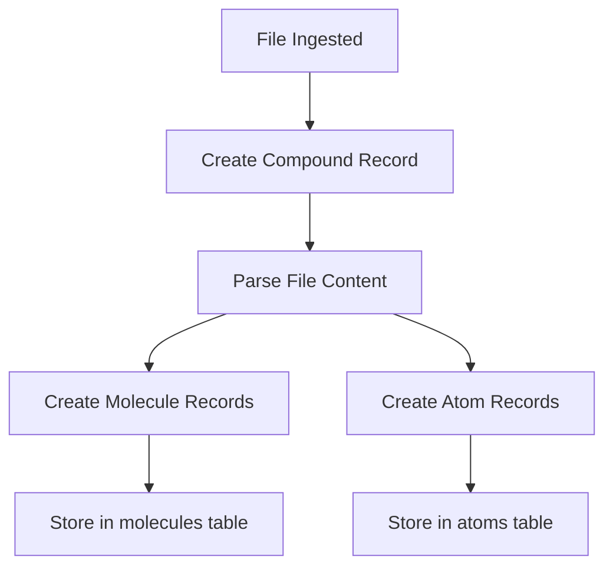
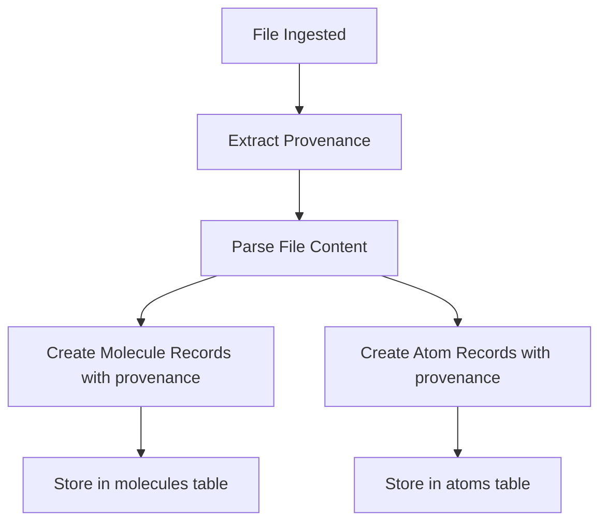

# Ingestion Pipeline Update Guide

## Overview

This document describes the changes needed to update the ingestion pipeline after removing the compounds table.

---

## Current Flow (Before Migration)



**SQL (simplified):**
```sql
-- Step 1: Create compound
INSERT INTO compounds (id, path, provenance, timestamp)
VALUES (uuid_generate_v4(), '/path/to/file.txt', 'source:xxx', NOW());

-- Step 2-3: Parse and create molecules/atoms (uses compound_id FK)
```

---

## New Flow (After Migration)



**SQL (new):**
```sql
-- Step 1: Extract provenance from file path
INSERT INTO molecules (id, source_path, content, provenance, molecular_signature, sequence, start_byte, end_byte, timestamp)
VALUES (
    uuid_generate_v4(),
    '/path/to/file.txt',
    'chunk content...',
    'source:xxx',  -- NEW: provenance from file path
    'sig123',      -- NEW: molecular signature
    1,             -- sequence number
    0,             -- start byte
    100,           -- end byte
    NOW()
);

-- Step 2: Create atoms with provenance
INSERT INTO atoms (id, source_path, content, provenance, simhash, embedding, timestamp)
VALUES (
    uuid_generate_v4(),
    '/path/to/file.txt',
    'atom content...',
    'source:xxx',  -- NEW: same provenance as molecules
    'abc123',
    vector_embedding(...),
    NOW()
);
```

---

## Code Changes Required

### 1. Remove Compound Creation from Ingestion Service

**File:** `engine/src/services/ingestion-service.ts` (or similar)

**Before:**
```typescript
async function ingestFile(filePath: string, content: string): Promise<void> {
  const compoundId = await createCompound(filePath); // REMOVE THIS LINE
  
  const molecules = parseMolecules(content, filePath, compoundId);
  const atoms = parseAtoms(content, filePath, compoundId);
  
  await insertMolecules(molecules);
  await insertAtoms(atoms);
}

async function createCompound(filePath: string): Promise<string> {
  // ... existing code to create compound record
}
```

**After:**
```typescript
async function ingestFile(filePath: string, content: string): Promise<void> {
  const provenance = extractProvenanceFromPath(filePath); // NEW
  
  const molecules = parseMolecules(content, filePath, provenance);
  const atoms = parseAtoms(content, filePath, provenance);
  
  await insertMolecules(molecules);
  await insertAtoms(atoms);
}

async function extractProvenanceFromPath(filePath: string): Promise<string> {
  // Extract provenance from file path or metadata
  // Example: return 'source:' + path.dirname(filePath);
}
```

### 2. Update Molecule/Atom Insert Functions

**Before:**
```typescript
async function insertMolecules(molecules: Molecule[]): Promise<void> {
  for (const mol of molecules) {
    await db.run(`
      INSERT INTO molecules (id, compound_id, content, sequence, ...)
      VALUES (?, ?, ?, ?, ...)
    `, [mol.id, mol.compoundId, mol.content, mol.sequence, ...]);
  }
}
```

**After:**
```typescript
async function insertMolecules(molecules: Molecule[]): Promise<void> {
  for (const mol of molecules) {
    await db.run(`
      INSERT INTO molecules (id, source_path, content, provenance, molecular_signature, sequence, start_byte, end_byte, ...)
      VALUES (?, ?, ?, ?, ?, ?, ?, ?, ...)
    `, [mol.id, mol.sourcePath, mol.content, mol.provenance, mol.signature, mol.sequence, mol.startByte, mol.endByte, ...]);
  }
}
```

### 3. Update Atom Insert Functions

**Before:**
```typescript
async function insertAtoms(atoms: Atom[]): Promise<void> {
  for (const atom of atoms) {
    await db.run(`
      INSERT INTO atoms (id, compound_id, source_path, content, ...)
      VALUES (?, ?, ?, ?, ...)
    `, [atom.id, atom.compoundId, atom.sourcePath, atom.content, ...]);
  }
}
```

**After:**
```typescript
async function insertAtoms(atoms: Atom[]): Promise<void> {
  for (const atom of atoms) {
    await db.run(`
      INSERT INTO atoms (id, source_path, provenance, content, ...)
      VALUES (?, ?, ?, ?, ...)
    `, [atom.id, atom.sourcePath, atom.provenance, atom.content, ...]);
  }
}
```

---

## Data Migration Notes

### Provenance Field Mapping

| Source (Compounds Table) | Destination (Molecules/Atoms Tables) |
|--------------------------|--------------------------------------|
| `compounds.provenance`   | `molecules.provenance`               |
|                          | `atoms.provenance`                   |

### Molecular Signature Mapping

| Source (Compounds Table) | Destination (Molecules Table) |
|--------------------------|-------------------------------|
| `compounds.molecular_signature` | `molecules.molecular_signature` |

---

## Testing Checklist

- [ ] Ingest a test file and verify molecules have provenance field populated
- [ ] Verify atoms have provenance field populated
- [ ] Run verification queries (`verify_migration.sql`)
- [ ] Test query that previously used compounds table (should now use molecules)
- [ ] Confirm no foreign key violations after dropping compounds table

---

## Rollback Procedure

If issues arise:

1. Restore from backup of compounds table data
2. Re-run original ingestion pipeline code
3. Fix bugs in new ingestion logic
4. Re-attempt migration after fixes

---

## Performance Impact

**Expected Improvements:**
- Reduced write overhead (one less INSERT per file)
- Simpler queries (no compound join needed)
- Fewer database operations during ingestion

**Potential Issues:**
- Queries that previously joined compounds table need updating
- External services using compounds API need migration