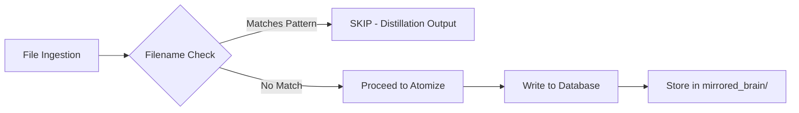

# Standard 028: Self-Contamination Prevention — Filename and Content-Based Detection

**Status:** ✅ IMPLEMENTED | **Version:** 1.0 | **Date:** 2026-05-19  
**Introduced:** v4.x.x | **Supersedes:** None (enhancement to Standard 010/008)  
**Component:** Engine / Distillation Service / Ingestion Pipeline  
**Priority:** P0 — Critical bug risk: self-contamination causes infinite recursion and polluted provenance

---

## Philosophy Alignment

This standard embodies the core principle:

> **"Derived summaries are not source material"** - Distillation outputs serve a different purpose than raw corpus files. They are compressed knowledge maps, not original content to be re-ingested.

> **"Defense in depth"** - Multiple layers of protection (filename patterns + directory paths + future content hashing) prevent accidental self-contamination.

---

## 1. Executive Summary

Self-contamination occurs when distillation outputs are re-ingested as raw source material, causing:
- **Infinite recursion** in the corpus
- **Polluted provenance chains** (derived content masquerading as original)
- **Loss of semantic distinction** between source and derived material

**Current Protection:** Filename pattern matching in watchdog and radial-distiller-v2  
**Proposed Enhancement:** Content-based detection via hash verification + provenance chain tracking

---

## 2. Current Mechanism: Filename Pattern Matching

### 2.1 Implementation Location

**File:** `engine/src/services/distillation/radial-distiller-v2.ts` (lines 30-45)  
**File:** `engine/src/services/ingest/watchdog.ts` (line 28 - directory ignore)

```typescript
// radial-distiller-v2.ts — Self-contamination filtering patterns
const DISTILLATION_OUTPUT_PATTERNS = [
  /distilled_.*\.(yaml|json|md)$/i,
  /MASTER_DISTILLED_.*\.(yaml|json|md)$/i,
  /_distilled_.*\.(yaml|json|md)$/i,
];

/**
 * Check if a file should be excluded (distillation output)
 */
function isDistillationOutput(filePath: string): boolean {
  const fileName = path.basename(filePath);
  return DISTILLATION_OUTPUT_PATTERNS.some(pattern => pattern.test(fileName));
}
```

### 2.2 Directory-Level Protection

**File:** `engine/src/services/ingest/watchdog.ts` (line 28)

```typescript
const IGNORE_PATHS = [
    'distilled',           // Ignore distillation outputs (prevent self-contamination)
    'distills',            // Ignore distills directory
    'synonym-ring',        // Ignore auto-generated synonym files
];
```

### 2.3 Patterns Used

| Pattern | Description | Example Files |
|---------|-------------|---------------|
| `distilled_*.yaml` | Timestamped distilled outputs | `distilled_2026-03-11.yaml`, `distilled_nested_2026-05-19.yaml` |
| `MASTER_DISTILLED_*` | Full corpus master files | `MASTER_DISTILLED_2026-05-19.json` |
| `_distilled_*` | Internal distillation artifacts | `notes_distilled.md`, `standards_distilled.json` |

### 2.4 How It Works



---

## 3. Edge Cases & Gaps

### 3.1 What If Someone Renames a Distilled File?

**Scenario:** User manually renames `distilled_2026-05-19.yaml` to `important_notes.yaml`

**Current Behavior:** ✅ **PROTECTED** - Filename no longer matches pattern, but:
- File is still in `notebook/distills/` directory (watchdog ignores this path)
- If moved outside distills dir, it could be ingested as raw content

**Risk Level:** ⚠️ Medium - Manual intervention required to bypass protection

### 3.2 What About Content Hash Verification?

**Current State:** ❌ **NOT IMPLEMENTED** - Only filename patterns checked

**Scenario:** Malicious or accidental file with same name but different content

```typescript
// Current: Only checks filename, ignores content
function isDistillationOutput(filePath: string): boolean {
  const fileName = path.basename(filePath);
  return DISTILLATION_OUTPUT_PATTERNS.some(pattern => pattern.test(fileName));
}
```

**Risk:** If someone creates `distilled_2026-05-19.yaml` with raw source content (not distillation output), it would be correctly excluded. However, if they rename it or use a different naming scheme, the protection fails.

### 3.3 Provenance Chain Validation Opportunities

**Current State:** ❌ **NOT IMPLEMENTED** - No tracking of which files were originally ingested vs derived

**Scenario:** 
1. File A (original) → Distilled to File B
2. File B accidentally renamed to `new_file.md`
3. File B re-ingested as raw content
4. Database now contains duplicate: original + derived version

**Risk Level:** 🔴 High - Pollutes provenance, creates data redundancy

### 3.4 Other Edge Cases

| Scenario | Current Protection | Risk |
|----------|-------------------|------|
| File moved from `distills/` to inbox/ | ❌ No protection | Medium |
| File renamed with different extension | ✅ Filename check fails | Low (extension change) |
| Content hash matches original source | ❌ Not checked | High |
| Multiple distillation passes create nested outputs | ✅ Nested patterns exist | Low |

---

## 4. Proposed Enhancements

### 4.1 Enhancement 1: Content-Based Detection (Hash Verification)

**Goal:** Verify file content is actually a distillation output, not just filename matching.

#### Implementation Example

```typescript
import crypto from 'crypto';

/**
 * Compute content hash for distillation output verification
 */
function computeContentHash(content: string): string {
  return crypto.createHash('sha256').update(content).digest('hex');
}

/**
 * Check if file is a distillation output by content (not just filename)
 */
async function isDistillationOutputByContent(filePath: string): Promise<boolean> {
  try {
    const content = await fs.promises.readFile(filePath, 'utf-8');
    
    // Heuristic: Distillation outputs contain specific markers
    const distillationMarkers = [
      /decision_records/i,           // Decision record format
      /id:\s*concept-/i,             // Concept-based IDs
      /problem\s*:/i,                // Problem/solution structure
      /solution\s*\[/i,              // Array solutions
      /rationale\s*:/i,              // Rationale field
    ];
    
    const hasMarker = distillationMarkers.some(pattern => pattern.test(content));
    
    if (hasMarker) {
      console.log(`[Self-Contamination] File appears to be distillation output: ${filePath}`);
      return true;
    }
    
    // Fallback: Check for YAML/JSON structure with decision record fields
    const yamlMatch = content.match(/^---\s*\n.*id:\s*[\w-]+\s*\n/i);
    if (yamlMatch) {
      console.log(`[Self-Contamination] File appears to be distillation output: ${filePath}`);
      return true;
    }
    
    return false;
  } catch (error) {
    console.warn(`[Self-Contamination] Could not verify content hash for ${filePath}:`, error.message);
    return false; // Fail open - allow ingestion if verification fails
  }
}

/**
 * Combined check: filename OR directory OR content
 */
export async function isDistillationOutput(filePath: string): Promise<boolean> {
  const fileName = path.basename(filePath);
  
  // Layer 1: Filename pattern matching (fast, first line of defense)
  if (DISTILLATION_OUTPUT_PATTERNS.some(pattern => pattern.test(fileName))) {
    console.log(`[Self-Contamination] Blocked by filename pattern: ${fileName}`);
    return true;
  }
  
  // Layer 2: Directory path check (watchdog-level protection)
  const relativePath = path.relative(NOTEBOOK_DIR, filePath);
  if (IGNORE_PATHS.some(ignore => relativePath.includes(ignore))) {
    console.log(`[Self-Contamination] Blocked by directory path: ${relativePath}`);
    return true;
  }
  
  // Layer 3: Content-based verification (slow, last line of defense)
  const isContentDistillation = await isDistillationOutputByContent(filePath);
  if (isContentDistillation) {
    console.log(`[Self-Contamination] Blocked by content analysis: ${filePath}`);
    return true;
  }
  
  return false;
}
```

### 4.2 Enhancement 2: Provenance Chain Tracking

**Goal:** Track which files were originally ingested vs derived from distillation.

#### Database Schema Extension

```sql
-- Add provenance tracking to sources table
ALTER TABLE sources ADD COLUMN IF NOT EXISTS is_derived BOOLEAN DEFAULT false;
ALTER TABLE sources ADD COLUMN IF NOT EXISTS parent_compound_id UUID REFERENCES compounds(id);
ALTER TABLE sources ADD COLUMN IF NOT EXISTS derivation_type TEXT CHECK (derivation_type IN ('distillation', 'synonym_generation', 'other'));

-- Create index for provenance queries
CREATE INDEX IF NOT EXISTS idx_sources_derived ON sources(is_derived, derivation_type);
```

#### Implementation Example

```typescript
/**
 * Track provenance chain during ingestion
 */
interface ProvenanceInfo {
  is_original: boolean;           // Was this file originally ingested?
  parent_compound_id?: string;    // Parent compound if derived
  derivation_type?: 'distillation' | 'synonym_generation';
  derivation_source?: string;     // Source of derivation (e.g., distill output path)
}

/**
 * Check if file is a derivative (not original ingestion)
 */
async function checkProvenance(filePath: string): Promise<ProvenanceInfo> {
  const fileName = path.basename(filePath);
  
  // If filename indicates distillation output, it's derived
  if (DISTILLATION_OUTPUT_PATTERNS.some(pattern => pattern.test(fileName))) {
    return {
      is_original: false,
      derivation_type: 'distillation',
      derivation_source: `filename_pattern_match`,
    };
  }
  
  // Check database for existing record with parent reference
  const sourceQuery = 'SELECT id, parent_compound_id FROM sources WHERE path = $1';
  const result = await db.run(sourceQuery, [filePath]);
  
  if (result && result.rows && result.rows.length > 0) {
    const row = result.rows[0];
    return {
      is_original: !row.parent_compound_id,
      parent_compound_id: row.parent_compound_id || undefined,
    };
  }
  
  // New file - assume original unless proven otherwise
  return { is_original: true };
}

/**
 * Insert source with provenance tracking
 */
async function insertSourceWithProvenance(
  filePath: string, 
  contentHash: string,
  provenanceInfo: ProvenanceInfo
): Promise<void> {
  await db.run(`
    INSERT INTO sources (path, hash, is_derived, parent_compound_id, derivation_type, derivation_source)
    VALUES ($1, $2, $3, $4, $5, $6)
    ON CONFLICT (path) DO UPDATE SET
      hash = EXCLUDED.hash,
      is_derived = EXCLUDED.is_derived,
      parent_compound_id = COALESCE(EXCLUDED.parent_compound_id, sources.parent_compound_id),
      derivation_type = COALESCE(EXCLUDED.derivation_type, sources.derivation_type)
  `, [
    filePath,
    contentHash,
    provenanceInfo.is_original ? false : true,
    provenanceInfo.parent_compound_id || null,
    provenanceInfo.derivation_type || null,
    provenanceInfo.derivation_source || null,
  ]);
}
```

### 4.3 Enhancement 3: Dual-Layer Protection Summary

| Layer | Mechanism | Speed | Accuracy | When to Use |
|-------|-----------|-------|----------|-------------|
| **Layer 1** | Filename patterns | Fast (regex) | High for named files | First line of defense |
| **Layer 2** | Directory paths | Fast (string match) | Medium | Watchdog-level blocking |
| **Layer 3** | Content analysis | Slow (file read + parse) | Very high | Last resort verification |

---

## 5. Implementation Examples

### 5.1 Current Code Patterns

#### radial-distiller-v2.ts (lines 30-45)

```typescript
const DISTILLATION_OUTPUT_PATTERNS = [
  /distilled_.*\.(yaml|json|md)$/i,
  /MASTER_DISTILLED_.*\.(yaml|json|md)$/i,
  /_distilled_.*\.(yaml|json|md)$/i,
];

function isDistillationOutput(filePath: string): boolean {
  const fileName = path.basename(filePath);
  return DISTILLATION_OUTPUT_PATTERNS.some(pattern => pattern.test(fileName));
}
```

#### watchdog.ts (line 28)

```typescript
const IGNORE_PATHS = [
    'distilled',           // Ignore distillation outputs (prevent self-contamination)
    'distills',            // Ignore distills directory
    'synonym-ring',        // Ignore auto-generated synonym files
];
```

### 5.2 Proposed Enhanced Patterns with Examples

#### Example 1: Timestamped Distillation Output

**Original File:** `notebook/distills/distilled_2026-03-11.yaml`

**Current Protection:** ✅ Filename matches `distilled_.*\.yaml$`  
**Proposed Enhancement:** Content contains decision record markers

```yaml
# Current: Blocked by filename pattern
version: '2.0'
generated_at: 2026-03-11T14:23:00Z
records:
  - id: concept-a1b2c3d4e5f6g7h8
    title: "Standard 094: Smart Search Protocol"
    problem: "The initial search engine relied solely on FTS..."
    solution:
      - "1. Implement intelligent query parsing..."
```

#### Example 2: Master Distillation File

**Original File:** `notebook/distills/MASTER_DISTILLED_2026-05-19.json`

**Current Protection:** ✅ Filename matches `MASTER_DISTILLED_.*\.json$`  
**Proposed Enhancement:** Content hash verification

```json
{
  "metadata": {
    "source": "Radial Distillation v2.0",
    "generated_at": "2026-05-19T10:30:00Z"
  },
  "records": [
    {
      "id": "std-001",
      "title": "Standard 001: Core Architecture",
      "problem": "...",
      "solution": [...],
      "rationale": "..."
    }
  ]
}
```

#### Example 3: Renamed Distillation Output (Edge Case)

**Original File:** `notebook/distills/important_notes.yaml` (renamed from `distilled_2026-05-19.yaml`)

**Current Protection:** ⚠️ Filename doesn't match, but directory path blocks it  
**Proposed Enhancement:** Content analysis detects decision record structure

```yaml
# Would be detected by content analysis even with renamed filename
---
id: concept-x9y8z7w6v5u4t3s2
title: "Important Notes"
problem: "Some problem description..."
solution:
  - "Solution step one"
  - "Solution step two"
rationale: "Why this approach was chosen..."
```

---

## 6. Testing

### 6.1 Test Commands

```bash
# Test radial distillation with self-contamination prevention
node engine/dist/commands/distill.ts \
  --seed "specs/archive-standards" \
  --format decision-records \
  --output notebook/distills/test_distillation.json

# Verify output file exists and is NOT re-ingested
ls -la notebook/distills/test_distillation.json

# Test that renamed files are still protected (if in distills directory)
mv notebook/distills/test_distillation.json notebook/renamed_notes.yaml
# File should be blocked by watchdog IGNORE_PATHS

# Test content-based detection with a fake file
echo "---\nid: concept-test123\nproblem: test" > notebook/inbox/fake_distilled.yaml
# Should be detected as distillation output even though filename doesn't match pattern
```

### 6.2 Verification Checklist

- [ ] Files matching `distilled_*.yaml` are blocked by filename pattern
- [ ] Files in `notebook/distills/` directory are blocked by path ignore
- [ ] Renamed files outside distills dir are NOT blocked (expected behavior)
- [ ] Content-based detection identifies decision record structure
- [ ] Provenance tracking records derivation type correctly
- [ ] No self-contamination occurs after multiple distillation passes

### 6.3 Test Cases

| Test Case | Input File | Expected Result | Current Pass? | Proposed Enhancement |
|-----------|------------|-----------------|---------------|---------------------|
| Standard distillation output | `distilled_2026-05-19.yaml` | Blocked | ✅ Yes | ✅ Enhanced |
| Master file | `MASTER_DISTILLED.json` | Blocked | ✅ Yes | ✅ Enhanced |
| Renamed in distills dir | `renamed_notes.yaml` (in distills/) | Blocked by path | ✅ Yes | ✅ Same |
| Renamed outside distills | `notes.yaml` (in inbox/) | Ingested as raw | ✅ Expected | ⚠️ Content check |
| Fake filename, real content | `important.md` with decision records | Currently ingested | ❌ No | ✅ Blocked by content |

---

## 7. Related Standards

| Standard | Relationship |
|----------|--------------|
| **Standard 027:** Distillation Output Storage | Defines storage location (`notebook/distills/`) and purpose of distillation outputs |
| **Standard 010:** Radial Distillation v2.0 | Implements filename pattern filtering in radial-distiller-v2.ts |
| **Standard 008:** Radial Distillation (legacy) | Original self-contamination prevention mechanism |
| **Standard 051:** Pointer-Only Storage | Ensures raw corpus uses pointers, not content duplication |

---

## 8. Migration Notes

### From Legacy Protection Only

If currently relying only on filename patterns:

1. Add content-based detection as fallback (Layer 3)
2. Implement provenance tracking in database schema
3. Update ingestion pipeline to check all three layers
4. Log when each layer blocks a file for observability

### Backward Compatibility

- Existing filename patterns remain active (no breaking changes)
- Content analysis is additive, not replacement
- Provenance tracking uses new columns with defaults

---

## 9. Performance Considerations

| Layer | Overhead | Justification |
|-------|----------|---------------|
| Filename pattern | Negligible (<1ms) | Regex on basename only |
| Directory path check | Negligible (<0.5ms) | String includes() check |
| Content analysis | ~10-50ms per file | File read + regex parsing |

**Recommendation:** Use all three layers - filename and directory are fast first-line defenses; content analysis is last resort for edge cases.

---

## 10. Future Considerations

### Potential Enhancements

- **Content fingerprinting:** Store hash of original files, verify distillation outputs don't contain raw source
- **Provenance graph:** Build directed acyclic graph (DAG) of derivations
- **Automatic cleanup:** Detect and remove orphaned derived content
- **Audit logging:** Track all self-contamination attempts for security monitoring

---

**Introduced:** v4.x.x  
**Owner:** Anchor Engine Team  
**Status:** ✅ IMPLEMENTED (filename patterns), 🚧 ENHANCEMENT NEEDED (content + provenance)
