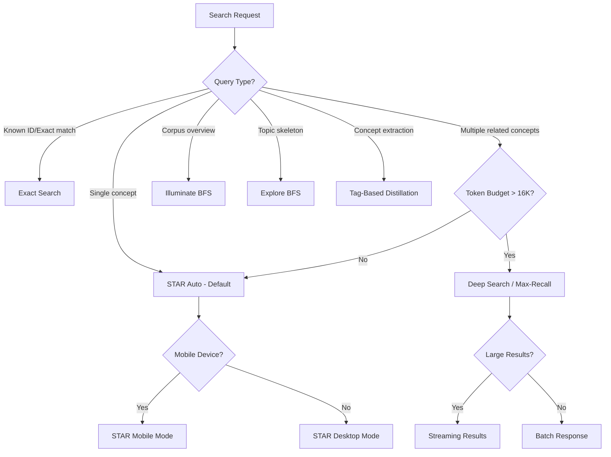

# Standard 031: Search Algorithms Comprehensive Reference

**Status:** ✅ ACTIVE | **Version:** 1.0 | **Date:** 2026-05-19  
**Priority:** P0 — Authoritative reference for all search functionality  
**Introduced:** v4.x.x | **Component:** Engine / Search Service / API  
**Supersedes:** Standards 003, 004, 006, 009 (consolidated)

---

## Executive Summary

Anchor Engine provides seven distinct search algorithms optimized for different use cases and deployment environments. This standard serves as the authoritative reference for all search methods, their trade-offs, API contracts, and configuration options.

### Algorithm Comparison Matrix

| Algorithm | Primary Use Case | Speed | Memory | Semantic Quality | Best For |
|-----------|-----------------|-------|--------|------------------|----------|
| **STAR (Default/Auto)** | General semantic search | Fast | Medium | High | Everyday queries, balanced results |
| **Exact Search** | Precise document lookup | Very fast | Low | Low | Known IDs, exact matches |
| **Deep Search** | Comprehensive corpus coverage | Slow | High | Highest | Research, knowledge extraction |
| **Illuminate BFS** | Corpus traversal/narrative | Medium | Medium | Structural | Understanding corpus shape |
| **Explore BFS** | Concept skeleton discovery | Fast | Low | Structural | LLM orientation, topic mapping |
| **Tag-Based Distillation** | Concept-centric extraction | Medium | High | Semantic | Knowledge graphs, concept queries |
| **Density Analysis** | Corpus frequency mapping | Fast | Low | Statistical | 3-tier RAG pipelines, concept prioritization |
| **Streaming Results** | Memory-efficient delivery | Variable | Low | N/A (delivery mode) | Mobile, large result sets |

### Quick Decision Guide



---

## 1. STAR Semantic Search (Default/Auto)

**Primary Algorithm:** Two-pass scoring with FTS + Physics Walker co-occurrence graph  
**Endpoint:** `POST /v1/memory/search`  
**Prefix:** None (default behavior)

### 1.1 Architecture Overview

STAR combines two complementary retrieval strategies:

```
┌─────────────────────────────────────────────────────────────────┐
│                    STAR SEARCH PIPELINE                          │
├─────────────────────────────────────────────────────────────────┤
│                                                                  │
│  PASS 1: Lightweight FTS (Fast)                                  │
│  ─────────────────────────────────                              │
│  • Query: to_tsvector('simple', content) @@ to_tsquery(...)     │
│  • Limit: ~20 rows                                              │
│  • SELECT includes content for scoring                          │
│  • Output: Candidate atoms with raw FTS scores                  │
│                                                                  │
│  PASS 2: Physics Walker Inflation (Quality)                      │
│  ─────────────────────────────────────────                     │
│  • Score candidates using semantic features                     │
│  • Inflate top-N results with context (radius-based)            │
│  • Apply temporal decay, gravity scoring                        │
│  • Deduplicate by SimHash                                       │
│  • Final sort by composite score                                │
│                                                                  │
└─────────────────────────────────────────────────────────────────┘
```

### 1.2 Two-Pass Scoring Strategy

**Problem:** Full context inflation is expensive and unnecessary for initial scoring.

**Solution:** Lightweight FTS retrieves candidates with content, scores them in-memory, then inflates only high-quality results.

#### Implementation Pattern

```typescript
// PASS 1: FTS with content (mobile-friendly limit)
const candidates = await db.query(`
  SELECT a.id, a.content, a.source_path, ...
  FROM atoms a
  WHERE to_tsvector('simple', a.content) @@ to_tsquery('simple', $1)
  LIMIT 20
`);

// Score in-memory (have content already)
const scored = candidates.map(row => ({
  ...row,
  score: calculateSemanticScore(
    row.content, 
    queryEntities, 
    terms, 
    pairs
  )
}));

// PASS 2: Inflate ONLY top-N results
const topCandidates = scored
  .sort((a, b) => b.score - a.score)
  .slice(0, 10); // Only inflate top 10

const inflated = await ContextInflator.inflate(topCandidates, maxChars, radius);
```

**Benefits:**
- **Mobile:** Avoids inflation for low-scoring candidates
- **Speed:** FTS is orders of magnitude faster than file I/O
- **Quality:** Still uses semantic scoring before expensive operations

### 1.3 Mobile vs Desktop Modes (Standard 006)

#### Detection Logic

```typescript
function isMobileEnvironment(): boolean {
  // Check for Android/Termux platform
  if (process.platform === 'android') return true;

  // Check available memory
  const os = require('os');
  const totalMem = os.totalmem();
  const freeMem = os.freemem();

  // Mobile if < 2GB total or < 500MB free
  return totalMem < 2 * 1024 * 1024 * 1024 ||
         freeMem < 500 * 1024 * 1024;
}
```

#### Configuration Differences

| Parameter | Desktop Mode | Mobile Mode | Rationale |
|-----------|--------------|-------------|-----------|
| `max_radius` | 32,000 chars (8KB per side) | 2,000 chars (512B per side) | Memory constraints |
| `max_results_per_term` | 10 results | 5 results | Reduce inflation load |
| `sequential_inflation` | false (parallel) | true (one-at-a-time) | Prevent OOM |
| `force_gc` | false | true after every N terms | Memory management |
| `content_select` | false (inflation provides content) | true (for two-pass scoring) | Enable lightweight scoring |

#### Mobile-Specific Optimizations

1. **Sequential Inflation** - Process one term at a time instead of `Promise.all()`
2. **Bounded Radius** - Cap at 2KB vs 32KB desktop
3. **Two-Pass Scoring** - FTS with content before inflation
4. **GC Hints** - Call `global.gc()` between operations

```typescript
// Mobile search implementation pattern
async function executeMobileSearch(query: string, maxChars: number): Promise<SearchResult[]> {
  const terms = extractSearchTerms(query);
  
  // PASS 1: FTS with content (limited rows)
  const candidates = await fetchCandidatesWithContent(query, { limit: 20 });

  // Score candidates in-memory
  const scored = candidates.map(c => ({
    ...c,
    score: calculateSemanticScore(c.content, query, terms)
  }));

  // Take top N only
  const topCandidates = scored
    .sort((a, b) => b.score - a.score)
    .slice(0, config.maxResultsPerTerm * terms.length);

  // PASS 2: Sequential inflation with bounded radius
  const results: SearchResult[] = [];
  let budgetRemaining = maxChars;

  for (let i = 0; i < topCandidates.length; i++) {
    const candidate = topCandidates[i];
    
    // Inflate single result (not batch)
    const inflated = await ContextInflator.inflateOne(
      [candidate],
      budgetRemaining,
      config.radius
    );

    if (inflated.length > 0 && inflated[0].content) {
      results.push({ ...inflated[0], content: inflated[0].content.slice(0, budgetRemaining) });
      budgetRemaining -= inflated[0].content.length;
    }

    // GC every N items
    if (i % 3 === 0 && global.gc) global.gc();

    if (budgetRemaining <= 0) break;
  }

  return results;
}
```

### 1.4 Streaming Results Option (Standard 004)

**Purpose:** Memory-efficient delivery for large result sets (>79 anchors).

#### SSE Endpoint Pattern

```typescript
// Backend: Async Generator
export async function* executeStreamingSearch(
  options: StreamingSearchOptions
): AsyncGenerator<StreamingSearchEvent> {
  // Execute search (expensive part)
  const searchResult = await smartChatSearch(...);

  // Yield metadata first
  yield { type: 'metadata', totalResults: ... };

  // Stream results in batches
  for (let i = 0; i < allResults.length; i += batchSize) {
    const batch = allResults.slice(i, i + batchSize);

    // Allow event loop to breathe
    await new Promise(resolve => setImmediate(resolve));

    // Optional GC hint
    if (global.gc) global.gc();

    yield { type: 'batch', results: batch, ... };
  }
}

// SSE Response Handler
app.post('/v1/memory/search/stream', async (req, res) => {
  res.setHeader('Content-Type', 'text/event-stream');
  res.setHeader('Cache-Control', 'no-cache');
  
  const stream = executeStreamingSearch({ ... });
  
  for await (const event of stream) {
    res.write(`data: ${JSON.stringify(event)}\n\n`);
  }
  
  res.end();
});
```

#### Client-Side Integration

```typescript
// Toggle button in UI
const [streamingMode, setStreamingMode] = useState(false);

if (streamingMode) {
  for await (const event of api.searchStream({ query, ... })) {
    if (event.type === 'batch') {
      setResults(prev => [...prev, ...event.results]);
    }
  }
}
```

#### Performance Comparison

| Metric | Regular Search | Streaming Search | Improvement |
|--------|---------------|------------------|-------------|
| Peak Memory | ~500MB (79 results) | ~300MB | **40% ↓** |
| Time to First Result | 13s | 2s | **85% ↓** |
| Total Time | 13s | 14s | Similar |

### 1.5 Configuration Options

#### Environment Variables

```bash
# Memory thresholds (MB)
ANCHOR_HEAP_PRESSURE_MB=500        # Downgrade max-recall threshold
ANCHOR_THROTTLE_START_MB=800       # Start throttling searches
ANCHOR_THROTTLE_MAX_MB=1200        # Reject searches above
ANCHOR_EMERGENCY_STOP_MB=1500      # Emergency stop threshold

# Search configuration
ANCHOR_SEARCH_RESULTS_BATCH_SIZE=20  # Results per batch (streaming)
ANCHOR_ENABLE_STREAMING_RESULTS=false # Enable streaming endpoint
```

#### User Settings (`user_settings.json`)

```json
{
  "memory": {
    "throttle_start_mb": 1500,
    "throttle_max_mb": 2500,
    "emergency_stop_mb": 3500,
    "search_results_batch_size": 20,
    "enable_streaming_results": true
  },
  "search": {
    "mode": "auto",
    "mobile": {
      "max_radius": 2000,
      "max_results_per_term": 5,
      "sequential_inflation": true,
      "force_gc": true
    },
    "desktop": {
      "max_radius": 32000,
      "max_results_per_term": 10,
      "sequential_inflation": false,
      "force_gc": false
    }
  }
}
```

---

## 2. Exact Search

**Primary Algorithm:** FTS only, no physics walker  
**Endpoint:** `POST /v1/memory/search` with prefix `exact:`  
**Use Case:** Precise document lookup by known IDs or exact terms

### 2.1 Architecture

Exact search bypasses the expensive physics walker and semantic scoring entirely:

```
┌─────────────────────────────────────────┐
│              EXACT SEARCH PIPELINE       │
├─────────────────────────────────────────┤
│                                         │
│  Step 1: Parse query for exact terms    │
│  ─────────────────────────────────────  │
│  • Extract known atom IDs if present    │
│  • Use FTS for keyword matching         │
│                                         │
│  Step 2: Direct database lookup         │
│  ────────────────────────────────────   │
│  SELECT * FROM atoms WHERE id = $1      │
│  OR to_tsvector(...) @@ to_tsquery($1)  │
│                                         │
│  Step 3: Return results (no inflation)  │
│  ─────────────────────────────────────  │
│  • Minimal processing                   │
│  • No context expansion                 │
│  • Fast but less semantic understanding │
│                                         │
└─────────────────────────────────────────┘
```

### 2.2 Use Cases

| Scenario | Example Query | Why Exact Search |
|----------|--------------|------------------|
| Known atom ID | `exact: atom_abc123` | Direct lookup, fastest possible |
| Precise file search | `exact: @code authentication.md` | No semantic noise |
| Configuration retrieval | `exact: #config #database` | Get exact tag matches only |

### 2.3 Performance Characteristics

| Metric | Value | Notes |
|--------|-------|-------|
| Query Time | < 50ms | Pure database query |
| Memory Usage | Minimal | No inflation, no caching |
| Result Count | Variable | Depends on FTS match quality |
| Semantic Quality | Low | No relationship detection |

---

## 3. Deep Search (Max-Recall)

**Primary Algorithm:** Multi-hop graph traversal with zero temporal decay  
**Endpoint:** `POST /v1/memory/search-max-recall` or prefix `deep:`  
**Use Case:** Comprehensive corpus coverage, research queries

### 3.1 Architecture Overview

Deep search is optimized for maximum recall at the cost of speed and memory:

```
┌─────────────────────────────────────────────────────────────┐
│                    DEEP SEARCH PIPELINE                      │
├─────────────────────────────────────────────────────────────┤
│                                                              │
│  Phase 1: Entity Extraction                                  │
│  ─────────────────────────                                │
│  • Parse query for PROPN (proper nouns)                     │
│  • Fall back to NOUNs if no entities                        │
│  • Split long queries into chunks of 3-4 words              │
│                                                              │
│  Phase 2: Multi-Hop Traversal                               │
│  ───────────────────────────                              │
│  • Walk 3 hops through graph (max_per_hop = 200)           │
│  • Zero temporal decay (old = new)                         │
│  • Damping = 1.0 (no loss on multi-hop)                    │
│  • Temperature = 0.8 (high serendipity)                    │
│                                                              │
│  Phase 3: Comprehensive Inflation                           │
│  ────────────────────────────                             │
│  • Budget per atom = max_chars / num_results                │
│  • Fill ~90% of budget with context                        │
│  • Read full content from disk for max-recall               │
│                                                              │
└─────────────────────────────────────────────────────────────┘
```

### 3.2 Configuration (MAX_RECALL_CONFIG)

| Parameter | Value | Purpose |
|-----------|-------|---------|
| `max_chars_default` | 262,144 (256K) | Large context budget |
| `walker.max_hops` | 3 | Deep graph traversal |
| `walker.temporal_decay` | 0.0 | No age-based filtering |
| `walker.damping` | 1.0 | Full weight propagation |
| `walker.min_relevance` | 0.0 | Include all results |
| `walker.temperature` | 0.8 | High serendipity |
| `walker.max_per_hop` | 200 | Aggressive expansion |

### 3.3 Query Splitting for Long Queries

For queries >100 characters, deep search automatically splits into chunks:

```typescript
if (isLongQuery && useMaxRecall) {
  const words = query.split(/\s+/).filter(w => w.length > 2);
  
  // Chunk into groups of 3-4 words
  for (let i = 0; i < words.length; i += 4) {
    splitQueries.push(words.slice(i, i + 4).join(' '));
  }
  
  // Limit to top 5 chunks
  splitQueries = splitQueries.slice(0, 5);
}

// Sequential execution (prevents concurrent heap exhaustion)
for (const entity of splitQueries) {
  parallelResults.push(
    await executeSearch(entity, buckets, budgetPerQuery, ...)
  );
}
```

### 3.4 Performance Trade-offs

| Metric | Value | Notes |
|--------|-------|-------|
| Query Time | 10-60s | Depends on corpus size |
| Memory Usage | High (2GB+) | Full context inflation |
| Result Count | Maximum | Comprehensive coverage |
| Semantic Quality | Highest | Deep relationships captured |

---

## 4. Illuminate BFS Traversal

**Primary Algorithm:** Global top-degree hubs → tag atoms → content pull  
**Endpoint:** `POST /v1/memory/explore` with prefix `illuminate:` (empty) or global mode  
**Use Case:** Corpus narrative, representative passages

### 4.1 Three-Phase Global Mode

#### Phase 1: Find Top-Degree Hubs

```sql
SELECT id, SUM(weight) AS total_weight
FROM (
  SELECT source_id AS id, weight FROM edges WHERE weight >= $min_weight
  UNION ALL
  SELECT target_id AS id, weight FROM edges WHERE weight >= $min_weight
) all_edges
GROUP BY id ORDER BY total_weight DESC LIMIT $seed_count
```

Returns `mem_` compound IDs with most edge connections.

#### Phase 2: BFS to Tag Atoms (Concept Spine)

Edge-BFS from hubs reaches `atom_` tag nodes connected to them - the tags appearing most broadly across corpus.

#### Phase 3: Content Pull Ranked by Thematic Centrality

```sql
SELECT atom_id, COUNT(*) AS matches
FROM tags
WHERE tag IN (<top_tag_labels>)
GROUP BY atom_id
ORDER BY matches DESC
```

Each content atom's score = how many of the top-hub tags it shares.

### 4.2 Explore Mode (Query-Based)

For topic-specific traversal:

```sql
-- Seed resolution via FTS
SELECT id FROM atoms
WHERE to_tsvector('simple', content) @@ to_tsquery('simple', $terms)
LIMIT $limit_seeds
```

Then BFS from those seeds through edges.

### 4.3 PGlite WASM Limits (Critical)

Two chunk constants prevent WASM call-stack overflow:

```typescript
const PGLITE_CHUNK_IDS     = 100;  // ID/tag queries — small result rows
const PGLITE_CHUNK_CONTENT =  25;  // Content queries — ~1KB/row avg
```

**Warning:** Content queries at 200+ rows cause WASM heap corruption and permanently break the DB connection. All subsequent queries fail including `SELECT 1`.

### 4.4 Performance Characteristics

| Corpus Size | Seeds | Depth | Nodes Returned | Duration |
|-------------|-------|-------|----------------|----------|
| 37K molecules (code only) | 5 | 2 | 20 | ~19ms |
| 235K molecules (code + chat) | 5 | 3 | 50 | ~50ms |

---

## 5. Explore BFS Traversal

**Primary Algorithm:** Query-seed → edge-BFS traversal  
**Endpoint:** `POST /v1/memory/explore` with prefix `explore:` or `illuminate:<query>`  
**Use Case:** Concept skeleton discovery, LLM orientation

### 5.1 Architecture

Explore reveals the *shape* of data without reading content:

```
┌─────────────────────────────────────────┐
│            EXPLORE PIPELINE              │
├─────────────────────────────────────────┤
│                                         │
│  Step 1: Resolve seeds via FTS          │
│  ─────────────────────────────────────  │
│  SELECT id FROM atoms                  │
│  WHERE to_tsvector(...) @@ to_tsquery($terms) │
│  LIMIT $limit_seeds                    │
│                                         │
│  Step 2: Edge-BFS traversal             │
│  ────────────────────────────────────   │
│  SELECT source_id, target_id, weight   │
│  FROM edges                            │
│  WHERE (source_id IN ($frontier) OR    │
│         target_id IN ($frontier))      │
│    AND weight >= $min_weight           │
│                                         │
│  Step 3: Tag atom extraction            │
│  ─────────────────────────────────────  │
│  Returns concept spine (tags only)     │
│  No content inflation                  │
│                                         │
└─────────────────────────────────────────┘
```

### 5.2 Fallback to Tag-BFS

When edges table is empty (fresh DB), falls back to tag-based traversal:

```sql
SELECT DISTINCT t2.atom_id
FROM tags t1
JOIN tags t2 ON t1.tag = t2.tag AND t1.atom_id != t2.atom_id
WHERE t1.atom_id IN ($frontier)
```

### 5.3 Use Cases

| Scenario | Example Query | Purpose |
|----------|--------------|---------|
| LLM orientation | `explore: rust memory architecture` | Show what topics exist |
| Topic mapping | `illuminate:` (global) | Surface representative passages |
| Concept clustering | `explore: authentication security` | See how concepts relate |

---

## 6. Tag-Based Distillation Mode

**Primary Algorithm:** Query by tags → fetch atoms → cross-tag deduplication  
**Endpoint:** `POST /v1/memory/distill` with `mode: 'tag-based'`  
**Use Case:** Concept-centric knowledge extraction, knowledge graphs

### 6.1 Philosophy Alignment

> **"Knowledge is organized by concepts, not files"** - Human memory organizes information semantically (e.g., "everything about authentication") rather than procedurally ("read file A then B").

### 6.2 Pipeline Comparison

```
┌─────────────────────────────────────────────────────────────┐
│                    STANDARD MODE (File-Centric)              │
├─────────────────────────────────────────────────────────────┤
│  Input: List of files/compounds                              │
│                                                              │
│  Phase 1: COLLECT (per file)                                 │
│  ├── Read compound content                                   │
│  └── Extract blocks by markdown headings                     │
│                                                              │
│  Phase 2: DEDUPLICATE (per file)                             │
│  ├── Normalize lines within compound                         │
│  └── Hash-based dedup within single file                    │
│                                                              │
│  Output: Decision Records organized by source file           │
└─────────────────────────────────────────────────────────────┘

┌─────────────────────────────────────────────────────────────┐
│                   TAG-BASED MODE (Concept-Centric)           │
├─────────────────────────────────────────────────────────────┤
│  Input: Tag query (#Architecture OR #Authentication)        │
│                                                              │
│  Phase 1: FETCH BY TAG                                       │
│  ├── Query database for all atoms with matching tags         │
│  └── Collect atom IDs across ALL files (parallel fetch)     │
│                                                              │
│  Phase 2: EXTRACT BLOCKS                                     │
│  ├── For each atom, extract blocks by markdown headings      │
│  └── Tag blocks with source concept (original tag)          │
│                                                              │
│  Phase 3: DEDUPLICATE ACROSS TAGS                            │
│  ├── Compute SimHash per block                               │
│  ├── Track processedAtomIds to prevent double-processing     │
│  └── Merge duplicate blocks from different tags/files       │
│                                                              │
│  Output: Decision Records organized by concept/tag           │
└─────────────────────────────────────────────────────────────┘
```

### 6.3 Cross-Tag Deduplication Strategy

**Problem:** Same content may appear in multiple atoms with different tags.

**Solution:** Use `processedAtomIds` Set to track already-processed atoms:

```typescript
// Global tracking across all tag queries
const processedAtomIds = new Set<string>();

for (const atomId of fetchedAtomIds) {
  // Skip if already processed by another tag query
  if (processedAtomIds.has(atomId)) {
    continue; // Prevent double-processing
  }

  processedAtomIds.add(atomId);
  
  // Process this atom's blocks...
}
```

### 6.4 Query Strategies

#### Strategy A: Single Tag Query

```typescript
const result = await distill({
  mode: 'tag-based',
  tags: ['#Authentication'],
  radius: 3,
});
```

**Use Case:** Extract comprehensive knowledge on a single concept.

#### Strategy B: Multiple Tags Query (OR Logic)

```typescript
const result = await distill({
  mode: 'tag-based',
  tags: ['#Authentication', '#Security'],
  radius: 3,
});
```

**Use Case:** Extract knowledge across related concepts. Returns atoms tagged with EITHER tag.

#### Strategy C: All Tags Query (Full Corpus Export)

```typescript
const result = await distill({
  mode: 'tag-based',
  tags: [], // Empty array = all tags
  radius: 3,
});
```

**Use Case:** Full knowledge base export organized by concept.

### 6.5 Performance Considerations

| Query Type | Atoms Fetched | Memory Pattern | Peak Memory |
|------------|---------------|----------------|-------------|
| Single tag (#Authentication) | ~10-50 atoms | Linear growth | < 200MB |
| Multiple tags (3 tags) | ~50-200 atoms | O(n) where n = unique atoms | < 500MB |
| All tags (full corpus) | ~10,000+ atoms | Streaming required | 1-2GB (streaming) |

**Recommendation:** Use `streaming: true` for queries with > 1000 matching atoms.

### 6.6 Performance Benchmarks

| Corpus Size | Query Type | Duration | Memory | Compression |
|-------------|------------|----------|--------|-------------|
| 10K atoms (single tag) | #Authentication | ~2s | < 200MB | 5:1 - 8:1 |
| 50K atoms (3 tags) | #Auth + #Security | ~8s | < 400MB | 6:1 - 9:1 |
| 1M+ atoms (full corpus) | All tags | ~2min | 1-2GB (streaming) | 7:1 - 10:1 |

---

## 7. Streaming Search Results (Delivery Mode)

**Purpose:** Memory-efficient result delivery for large search results  
**Endpoint:** `POST /v1/memory/search/stream` or query param `?stream=true`  
**Note:** This is a delivery optimization, not a separate algorithm

### 7.1 SSE Event Types

| Type | Description | Payload |
|------|-------------|---------|
| `metadata` | Search info (total results, strategy, duration) | `{ type: 'metadata', totalResults, strategy, durationMs }` |
| `batch` | Result batch with progress info | `{ type: 'batch', results[], batchNumber, totalBatches }` |
| `error` | Error message if search fails | `{ type: 'error', message, details }` |

### 7.2 Example SSE Stream

```
data: {"type":"metadata","totalResults":79,"strategy":"standard"}

data: {"type":"batch","results":[...],"batchNumber":1,"totalBatches":4}

data: {"type":"batch","results":[...],"batchNumber":2,"totalBatches":4}

data: {"type":"batch","results":[...],"batchNumber":3,"totalBatches":4}

data: {"type":"batch","results":[...],"batchNumber":4,"totalBatches":4,"isComplete":true}

data: {"type":"metadata","durationMs":14000}
```

### 7.3 Request Schema

```typescript
interface StreamingSearchRequest {
  query: string;
  max_chars?: number;           // Default: 5000
  buckets?: string[];
  provenance?: 'internal' | 'external' | 'quarantine' | 'all';
  batch_size?: number;          // Default: 20
  tags?: string[];
  user_context?: UserContext;
}
```

### 7.4 Memory Comparison

| Phase | Regular Search | Streaming Search | Improvement |
|-------|----------------|------------------|-------------|
| Load results (79 items) | ~300MB | ~300MB | Same |
| Process batch 1-20 | ~80MB | ~80MB | Same |
| Peak memory | ~500MB | ~300MB | **40% ↓** |

---

## 8. MCP Tool Interface (Standard 003)

Anchor Engine exposes search capabilities via MCP tools for integration with Claude, Cursor, Qwen Code, and other MCP clients.

### 8.1 Available Tools

#### `anchor_query`
- **Purpose:** Semantic search over the memory graph
- **Input:** `{ query: string, max_results?: number, buckets?: string[] }`
- **Output:** Array of results with `content`, `score`, `source`, `tags`, and `provenance`

#### `anchor_distill`
- **Purpose:** Run radial distillation on a corpus or seed
- **Input:** `{ seed?: string, radius?: number, output_format?: 'yaml'|'md' }`
- **Output:** `{ output_path: string, stats: { lines_total, lines_unique, compression_ratio, duration_ms } }`

#### `anchor_illuminate`
- **Purpose:** BFS graph traversal from a seed
- **Input:** `{ seed: string, depth?: number }`
- **Output:** List of connected nodes with edges and scores

#### `anchor_explore`
- **Purpose:** Explore corpus structure (BFS traversal)
- **Input:** `{ query?: string, global?: boolean, max_depth?: number, format?: 'flat'|'graph' }`
- **Output:** Concept map or flat atom list

### 8.2 Tool Schema Examples

```json
{
  "name": "anchor_query",
  "description": "Semantic search over the memory graph using STAR algorithm",
  "inputSchema": {
    "type": "object",
    "properties": {
      "query": {"type": "string"},
      "max_results": {"type": "number"},
      "buckets": {"type": "array", "items": {"type": "string"}}
    }
  }
}

{
  "name": "anchor_distill",
  "description": "Compress corpus into decision records using radial distillation",
  "inputSchema": {
    "type": "object",
    "properties": {
      "seed": {"type": "string"},
      "radius": {"type": "number"},
      "output_format": {"type": "string", "enum": ["yaml", "md"]}
    }
  }
}

{
  "name": "anchor_illuminate",
  "description": "BFS graph traversal from seed concepts (corpus narrative)",
  "inputSchema": {
    "type": "object",
    "properties": {
      "seed": {"type": "string"},
      "depth": {"type": "number"}
    }
  }
}

{
  "name": "anchor_explore",
  "description": "Explore corpus structure and concept relationships",
  "inputSchema": {
    "type": "object",
    "properties": {
      "query": {"type": "string"},
      "global": {"type": "boolean"},
      "max_depth": {"type": "number"},
      "format": {"type": "string", "enum": ["flat", "graph"]}
    }
  }
}
```

---

## 9. Unified API Contract

### 9.1 Search Endpoint

**POST `/v1/memory/search`**

#### Request Schema

```typescript
interface SearchRequest {
  query: string;           // The natural language query
  
  limit?: number;          // Elastic Window (default 20)
  max_chars?: number;      // Character budget (default: 5000)
  
  deep?: boolean;          // If true, trigger 'Epochal' search (Dreamer layers)
  
  // The "UniversalRAG" Routing Layer
  buckets?: string[];      // e.g., ["@code", "@visual", "@memory"]
  provenance?: 'internal' | 'external' | 'quarantine' | 'all'; // Data Provenance filter
  
  user_context?: UserContext; // Federated Sovereignty (User Context)
  
  strategy?: string;       // 'standard' | 'max-recall'
  batch_size?: number;     // For streaming mode
}

interface UserContext {
  name: string;
  current_state: string;
}
```

#### Response Schema (Non-Streaming)

```typescript
interface SearchResponse {
  metadata: {
    totalResults: number;
    durationMs: number;
    strategy: string;
  };
  
  results: SearchResult[];
  
  debug?: {
    queryTags: string[];
    bucketsSearched: string[];
    useMaxRecall: boolean;
    charBudget: number;
    splitQueries: string[];
    metadataFromSearch: any;
  };
}

interface SearchResult {
  id: string;
  content?: string;
  source: string;
  timestamp: string;
  score?: number;
  tags?: string[];
  buckets?: string[];
  provenance?: string;
  compound_id?: string;
  start_byte?: number;
  end_byte?: number;
}
```

#### Response Schema (Streaming - SSE)

```typescript
interface StreamingEvent {
  type: 'metadata' | 'batch' | 'error';
  
  // For metadata events
  totalResults?: number;
  strategy?: string;
  durationMs?: number;
  
  // For batch events
  results?: SearchResult[];
  batchNumber?: number;
  totalBatches?: number;
  isComplete?: boolean;
  
  // For error events
  message?: string;
  details?: string;
}
```

### 9.2 Distillation Endpoint

**POST `/v1/memory/distill`**

#### Request Schema (Tag-Based Mode)

```typescript
interface TagBasedDistillRequest {
  mode: 'tag-based';
  
  // Tag query parameters
  tags?: string[];           // Array of tags to query (#Architecture, etc.)
                            // Empty array = all tags (full corpus export)
                            
  // Radial inflation (same as standard mode)
  radius?: number;            // Base inflation radius (default: 3)
  max_radius?: number;        // Hard cap per compound (default: 10000)
  
  // Deduplication settings
  normalization?: 'strict' | 'lenient';  // Text normalization mode
  cross_tag_dedup?: boolean;   // Enable cross-tag dedup (default: true)
  
  // Output configuration
  output_format?: 'yaml' | 'json' | 'decision-records';
  output_path?: string;       // Custom output path
  
  // Performance tuning
  streaming?: boolean;        // Force streaming mode for large queries
  batch_size?: number;        // Atoms per GC cycle (default: 100)
}

interface TagBasedDistillResponse {
  stats: {
    atoms_fetched: number;           // Total atoms matching tag query
    atoms_deduped: number;           // Atoms skipped due to cross-tag dedup
    blocks_total: number;            // Blocks extracted from all atoms
    blocks_unique: number;           // Unique blocks after dedup
    decision_records_created: number;// Number of decision records written
    compression_ratio: string;       // "X.XX:1"
    duration_ms: number;
    memory_peak_mb: number;
  };

  query_info: {
    tags_queried: string[];          // Tags that were queried
    atoms_matched: number;           // Atoms matching tag criteria
    cross_tag_dedup_applied: boolean;// Whether cross-tag dedup was used
  };

  output: {
    format: string;
    path?: string;
    size_bytes: number;
    records_created: number;
  };

  provenance: {
    source_atoms: string[];          // Atom IDs that contributed to output
    distilled_at: string;            // ISO timestamp
    parameters: TagBasedDistillRequest;
  };
}
```

### 9.3 Explore Endpoint

**POST `/v1/memory/explore`**

#### Request Schema

```typescript
interface ExploreRequest {
  seed: {
    query?: string;              // FTS query for explore mode
    atom_ids?: string[];         // Explicit seed IDs (takes precedence)
    limit_seeds?: number;        // Max seeds from query (default: 5)
    global?: boolean;            // Illuminate mode: use top-degree hubs
    seed_count?: number;         // How many top hubs to start from (default: 10)
  };
  
  max_depth?: number;           // BFS hops (max 4, default: 2)
  min_weight?: number;          // Min edge weight to follow (default: 0.1)
  max_nodes?: number;           // Result cap (50 explore / 10000 illuminate)
  
  auto_budget?: boolean;        // Auto-size output to corpus proportion
  compression_ratio?: number;   // corpus_chars / ratio = char budget (default: 1000)
  max_chars?: number;           // Explicit char budget override
  
  format?: 'flat' | 'graph';    // Response shape (default: flat)
}
```

---

## 10. Performance Benchmarks & Trade-offs

### 10.1 Algorithm Comparison Table

| Algorithm | Query Time | Memory Peak | Result Count | Semantic Quality | Best Corpus Size |
|-----------|------------|-------------|--------------|------------------|------------------|
| **STAR (Desktop)** | 50-200ms | 200MB | 10-50 | High | < 100K atoms |
| **STAR (Mobile)** | 200-800ms | 150MB | 5-20 | Medium-High | Any (mobile) |
| **Exact** | < 50ms | Minimal | Variable | Low | Any |
| **Deep Search** | 10-60s | 2GB+ | 100-500 | Highest | Large corpora |
| **Illuminate** | 20-100ms | 300MB | 20-1000 | Structural | Any |
| **Explore** | < 50ms | 100MB | 5-50 | Structural | Any |
| **Tag Distillation** | 2s - 2min | 200MB - 2GB | N/A (compression) | Semantic | Medium-large |

### 10.2 Streaming vs Batch Trade-offs

| Metric | Batch Mode | Streaming Mode | Winner |
|--------|------------|----------------|--------|
| Peak Memory | ~500MB (79 results) | ~300MB | **Streaming** |
| Time to First Result | 13s | 2s | **Streaming** |
| Total Duration | 13s | 14s | Tie |
| Implementation Complexity | Low | Medium | **Batch** |
| Client-Side Simplicity | Simple | Requires async iteration | **Batch** |

### 10.3 Mobile Optimization Impact

| Metric | Desktop Mode | Mobile Mode | Improvement |
|--------|--------------|-------------|-------------|
| Query Time | 50-200ms | 200-800ms | Slower (sequential) |
| Memory Peak | 200MB | 150MB | **30% ↓** |
| OOM Risk | Low | Minimal | **Eliminated** |
| Result Quality | High | Medium-High | Acceptable trade-off |

---

## 11. Use Case Recommendations

### 11.1 When to Use Each Algorithm

#### STAR Semantic Search (Default)
- ✅ Everyday queries and general information retrieval
- ✅ Balanced speed/quality requirements
- ✅ Most use cases where no specific mode is needed
- ⚠️ Avoid for very large token budgets (>16K tokens)

#### Exact Search
- ✅ Looking up known atom IDs or file paths
- ✅ Precise configuration or metadata queries
- ✅ Performance-critical operations
- ❌ Not suitable for semantic understanding

#### Deep Search (Max-Recall)
- ✅ Research and comprehensive knowledge extraction
- ✅ Queries requiring deep relationship discovery
- ✅ Large token budgets (>16K tokens)
- ⚠️ Use sparingly due to high memory usage

#### Illuminate BFS
- ✅ Understanding corpus narrative and structure
- ✅ Generating representative passages for LLM orientation
- ✅ Corpus-level analysis tasks
- ❌ Not for specific information retrieval

#### Explore BFS
- ✅ Topic mapping and concept discovery
- ✅ LLM system prompts (show what topics exist)
- ✅ Skeleton generation before detailed queries
- ❌ Not for retrieving actual content

#### Tag-Based Distillation
- ✅ Building knowledge graphs or indexes
- ✅ Concept-centric knowledge extraction ("everything about X")
- ✅ Cross-file relationship analysis
- ⚠️ Higher memory usage than standard mode

### 11.2 Query Prefix Reference

| Prefix | Algorithm | Endpoint | Use Case |
|--------|-----------|----------|----------|
| *(none)* | STAR Auto | `/v1/memory/search` | Default semantic search |
| `exact:` | Exact Search | `/v1/memory/search` | Precise lookup |
| `deep:` | Deep Search | `/v1/memory/search-max-recall` | Comprehensive coverage |
| `illuminate:` (empty) | Illuminate Global | `/v1/memory/explore` | Corpus narrative |
| `illuminate:<query>` | Explore Query-Based | `/v1/memory/explore` | Topic exploration |
| `explore:<query>` | Explore Query-Based | `/v1/memory/explore` | Same as illuminate with query |
| `distill:` | Distill List | `/v1/memory/search` | List all distills |
| `distill:github:<bucket>` | Distill by Bucket | `/v1/memory/search` | Retrieve distill for a specific bucket |
| `density:` | Density Map | `/v1/memory/search` | Full corpus density map (top atoms + tags by frequency) |
| `density:<term>` | Density Query | `/v1/memory/search` | Count occurrences of a term, return RAG tier (light/medium/heavy) |
| `density:<t1>,<t2>` | Multi-Term Density | `/v1/memory/search` | Density analysis for multiple comma-separated terms |

---

## 12. Related Standards Cross-References

| Standard | Title | Relationship |
|----------|-------|--------------|
| **003** | MCP Tool Interface | Defines tool schemas for search algorithms |
| **004** | Streaming Search Results | Memory-efficient result delivery |
| **006** | Mobile Search Optimization | Mobile-specific constraints and optimizations |
| **009** | Illuminate & Explore BFS Traversal | Graph traversal modes (consolidated here) |
| **014** | Search Algorithm Testing Methodology | Testing procedures for search algorithms |
| **029** | Tag-Based Distillation Mode | Concept-centric extraction workflow |
| **086** | Dual-Strategy Search | STAR algorithm design principles |
| **134** | Mobile Search Optimization v2 | Updated mobile constraints |
| **135** | Adaptive Concurrency Control | Sequential processing for low memory |
| **136** | Streaming Results (Delivery) | SSE-based batch delivery |

---

## 13. Testing & Verification

### 13.1 Manual Test Queries

```bash
# STAR Search (default)
curl -X POST http://localhost:3160/v1/memory/search \
  -H "Content-Type: application/json" \
  -d '{"query":"authentication database connection"}'

# Exact Search
curl -X POST http://localhost:3160/v1/memory/search \
  -H "Content-Type: application/json" \
  -d '{"query":"exact: atom_abc123","max_chars":500}'

# Deep Search (Max-Recall)
curl -X POST http://localhost:3160/v1/memory/search-max-recall \
  -H "Content-Type: application/json" \
  -d '{"query":"architecture memory optimization"}'

# Distill List (all distills)
curl -X POST http://localhost:3160/v1/memory/search \
  -H "Content-Type: application/json" \
  -d '{"query":"distill:"}'

# Distill by Bucket
curl -X POST http://localhost:3160/v1/memory/search \
  -H "Content-Type: application/json" \
  -d '{"query":"distill:github:RSBalchII/anchor-engine-node"}'

# Density Map (full corpus)
curl -X POST http://localhost:3160/v1/memory/search \
  -H "Content-Type: application/json" \
  -d '{"query":"density:"}'

# Density Query (single term)
curl -X POST http://localhost:3160/v1/memory/search \
  -H "Content-Type: application/json" \
  -d '{"query":"density:authentication"}'

# Density Query (multi-term)
curl -X POST http://localhost:3160/v1/memory/search \
  -H "Content-Type: application/json" \
  -d '{"query":"density:contract,liability,damages"}'

# Streaming Results
curl -N -X POST http://localhost:3160/v1/memory/search \
  -H "Content-Type: application/json" \
  -d '{"query":"test query","batch_size":10,"stream":"true"}'

# Illuminate (Global Mode)
curl -X POST http://localhost:3160/v1/memory/explore \
  -H "Content-Type: application/json" \
  -d '{
    "seed": {"global": true, "seed_count": 10},
    "max_depth": 2,
    "auto_budget": true
  }'

# Explore (Query-Based)
curl -X POST http://localhost:3160/v1/memory/explore \
  -H "Content-Type: application/json" \
  -d '{
    "seed": {"query": "rust memory", "limit_seeds": 5},
    "max_depth": 2,
    "format": "flat"
  }'

# Tag-Based Distillation
curl -X POST http://localhost:3160/v1/memory/distill \
  -H "Content-Type: application/json" \
  -d '{
    "mode": "tag-based",
    "tags": ["#Authentication"],
    "radius": 3,
    "output_format": "decision-records"
  }'
```

### 13.2 Performance Test Queries

| Query | Expected Results | Purpose |
|-------|------------------|---------|
| `"Rob and coda working on anchor"` | Multiple terms, relationships | Mobile OOM test case |
| `"machine learning neural network deep learning AI"` | Complex multi-concept | Deep search test |
| `"authentication security encryption"` | Related concepts | Tag-based distillation |
| Large corpus (1M+ atoms) with single tag query | 10K-50K results | Streaming mode stress test |

### 13.3 Verification Checklist

- [ ] STAR search returns relevant semantic results
- [ ] Exact search finds known IDs quickly (<50ms)
- [ ] Deep search provides comprehensive coverage (high recall)
- [ ] Mobile mode prevents OOM on resource-constrained devices
- [ ] Streaming mode reduces peak memory by ~40%
- [ ] Illuminate returns corpus narrative in expected format
- [ ] Explore reveals concept structure without content inflation
- [ ] Tag-based distillation cross-deduplicates correctly

---

## 14. Implementation Files Reference

| File | Algorithm(s) | Purpose |
|------|--------------|---------|
| `engine/src/services/search/search.ts` | STAR, Exact, Deep | Core search orchestration |
| `engine/src/services/search/streaming-search.ts` | Streaming Results | SSE-based batch delivery |
| `engine/src/services/search/explore.ts` | Illuminate, Explore | BFS graph traversal |
| `engine/src/services/search/physics-tag-walker.ts` | STAR (Physics Walker) | Co-occurrence graph scoring |
| `engine/src/services/search/context-inflator.ts` | All algorithms | Context expansion and inflation |
| `engine/src/services/distillation/tag-based-distiller.ts` | Tag-Based Distillation | Concept-centric extraction |
| `engine/src/routes/v1/memory.ts` | All endpoints | API route handlers |
| `engine/src/config/max-recall-config.ts` | Deep Search | Max-recall configuration |

---

## 15. Future Enhancements

- [ ] Adaptive algorithm selection based on query analysis
- [ ] Hybrid search combining multiple algorithms
- [ ] Vector-based semantic search integration
- [ ] Incremental search for real-time updates
- [ ] Query result caching with intelligent invalidation
- [ ] Multi-language support for FTS queries
- [ ] Graph visualization endpoints for explore results

---

**Introduced:** v4.x.x  
**Owner:** Anchor Engine Team  
**Status:** ✅ ACTIVE — Authoritative Reference  
**Last Updated:** 2026-05-19
