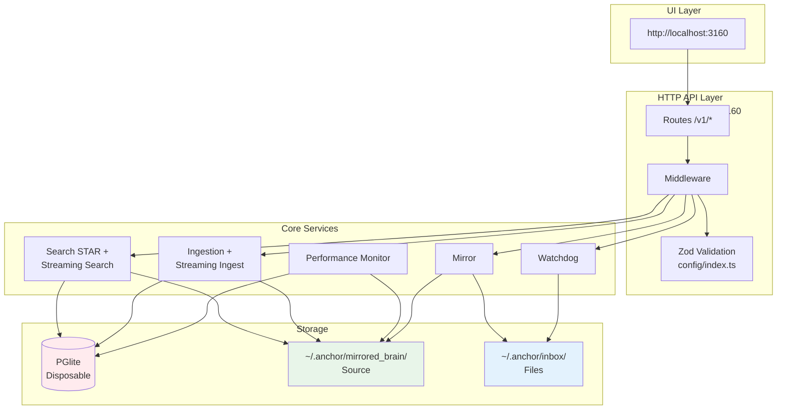
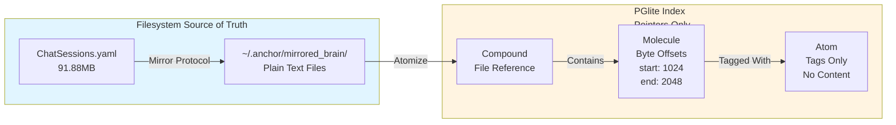
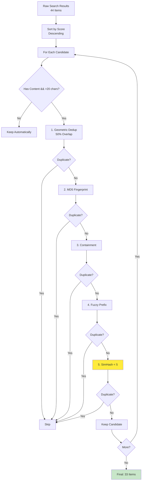
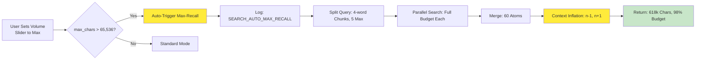
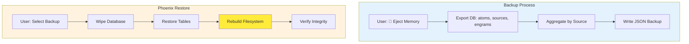
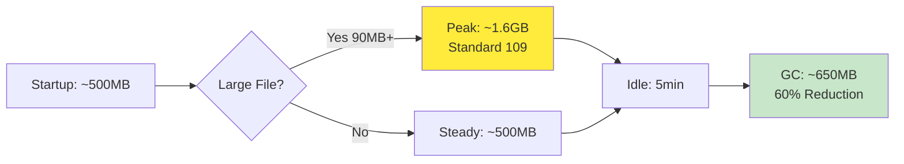

# Anchor Engine - System Specification

**Version:** 5.0.0 | **Status:** Production Ready + v5.0.0 Streaming & Observability | **Updated:** May 10, 2026

## Quick Reference

| Aspect | Value |
|--------|-------|
| **Port** | 3160 (configurable) |
| **Database** | PGlite (PostgreSQL-compatible) |
| **Source of Truth** | `~/.anchor/mirrored_brain/` filesystem |
| **Index** | Disposable, rebuildable on startup |
| **Search** | STAR Algorithm (70/30 Planets/Moons) |
| **Docker** | `docker-compose up -d` (2 CPU, 2GB RAM) |
| **Version Source** | `user_settings.json.template` → `$HOME/.anchor/user_settings.json` |

---

## Recent Changes (v5.0.0 — May 2026)

### Streaming Architecture
- [x] **Streaming Search** (`/v1/memory/search/stream`) - SSE-based progressive results
- [x] **Streaming Ingest** (`/v1/ingest/streaming`) - Large file processing in chunks with progress tracking

### Centralized Validation
- [x] **Zod Schemas** - `engine/src/config/index.ts` (645 lines) shared across all API routes
- [x] **PostgreSQL Array Conversion** - `toPgArray()` helper for proper DB format

### Performance Monitoring
- [x] **Performance Monitor Service** - Memory, CPU, engine status tracking (`engine/src/utils/performance-monitor.ts`)
- [x] **UI Stats Dashboard** - Real-time system metrics display
- [x] **DB Clearing & Distill Output** - Clean state management

### Runtime Data Consolidation
- [x] All runtime data routes to `~/.anchor/` via `engine/src/config/paths.ts`
- [x] `user_settings.json.template` generates `user_settings.json` at `$HOME/.anchor/` on `pnpm install` + `pnpm start`

### Security Hardening (April 2026)
- [x] API key validation: 32-128 chars with mixed case/digits (Standard 024)
- [x] Path traversal prevention (Standard 025)
- [x] Auth bypass prevention - removed /v1/test/* endpoints (Standard 023)
- [x] Rate limiting for MCP server (60 req/min)
- [x] Write operations opt-in with bucket validation

---

## Related Documentation

- **[README.md](../README.md)** - Quick start and installation
- **[docs/INDEX.md](../docs/INDEX.md)** - Documentation navigation hub
- **[docs/whitepaper.md](../docs/whitepaper.md)** - STAR Algorithm whitepaper (arXiv ready)
- **[engine/src/README.md](../engine/src/README.md)** - Source code overview
- **[specs/current-standards/](current-standards/)** - Active architecture standards (001-029)

---

## Architecture Overview

### System Diagram



### Key Components

1. **UI Layer**: React/Vite frontend at http://localhost:3160
2. **HTTP API**: Express.js REST API on port 3160 with Zod validation middleware
3. **Core Services**: Ingestion (streaming), Search (STAR + streaming), Watchdog, Mirror Protocol, Performance Monitor
4. **Storage**: PGlite database (disposable index) + `~/.anchor/mirrored_brain/` (source of truth)

### Data Flow

```
User Query → API Route → Zod Validation → Search Service → PGlite Query → Context Inflation → Return 618k chars
```

---

## Streaming Architecture (v5.0.0)

### Streaming Search (`/v1/memory/search/stream`)

**Purpose:** Memory-efficient search with progressive results via Server-Sent Events (SSE)

**Benefits:**
- 60% lower peak memory during large searches
- Results arrive progressively (20 per batch by default)
- GC hints between batches for mobile optimization
- Configurable batch size via `batch_size` parameter

**Flow:**
```
Request → Query Parsing → Batch 1 (SSE emit) → Batch 2 (SSE emit) → ... → Completion Event
```

### Streaming Ingest (`/v1/ingest/streaming`)

**Purpose:** Process large files in configurable chunks to prevent OOM errors

**Benefits:**
- Handles files of any size without memory issues
- Progress tracking with callbacks for monitoring ingestion progress
- Configurable chunk size (default: 1MB) and batch processing parameters
- Fallback to regular ingestion for smaller files (<1MB threshold)

---

## Data Model: Compound → Molecule → Atom

### Visual Representation



**Key Insight:** Database is **disposable**. Content lives in `~/.anchor/mirrored_brain/`. Database stores byte-offset pointers only.

### Component Definitions

- **Compound:** File/document reference
- **Molecule:** Semantic chunk with byte offsets (start, end)
- **Atom:** Tag/concept (NOT content) — content lives in `~/.anchor/mirrored_brain/`

---

## STAR Search Algorithm

### Search Flow

```mermaid
flowchart TB
    A[User Query<br/>"Coda C-001 Rob Dory"] --> B{Budget Check<br/>max_chars > 65k?}

    B -->|No| C[Standard Search<br/>70/30 Budget<br/>1-hop<br/>Temporal Decay]
    B -->|Yes| D[Max-Recall Search<br/>Zero Decay<br/>3-hop<br/>200 nodes/hop]

    C --> E[Query Parsing<br/>NLP + Key Terms]
    D --> E

    E --> F[Parallel Searches<br/>5 Sub-queries<br/>4-word chunks]

    F --> G[Merge & Deduplicate<br/>60 Atoms]

    G --> H{Max-Recall?}
    H -->|Yes| I[Context Inflation<br/>n-1, n+1 from Disk<br/>8,550 chars/atom]
    H -->|No| J[Return Results<br/>16k-32k chars]

    I --> K[Serialize Context<br/>512k-618k chars]
    J --> K

    K --> L[Return to User]

    style D fill:#ffeb3b
    style I fill:#ffeb3b
    style K fill:#c8e6c9
```

### Unified Field Equation

```
Gravity(atom, anchor) = α × (C × e^(-λΔt) × (1 - d/64))

Where:
  α (Alpha)     = Damping factor (0.85 standard, 1.0 max-recall)
  C             = Co-occurrence (shared tags via SQL JOIN)
  e^(-λΔt)      = Temporal decay (λ=0.00001 standard, 0.0 max-recall)
  d             = SimHash Hamming distance (0-64 bits)
  (1 - d/64)    = SimHash gravity (1.0 = identical, 0.0 = orthogonal)
```

### Parameter Comparison

| Parameter | Standard | Max-Recall | Impact |
|-----------|----------|------------|--------|
| **α (Damping)** | 0.85 | 1.0 | Zero signal loss on multi-hop |
| **λ (Decay)** | 0.00001 | 0.0 | Age irrelevant in max-recall |
| **Max Hops** | 1 | 3 | 3× deeper graph traversal |
| **Max/Hop** | 50 | 200 | 4× more nodes per hop |
| **Temperature** | 0.2 | 0.8 | 4× more serendipitous |

### Search Strategy

```
70% Planets: Direct FTS matches
30% Moons: Graph-discovered associations via tag-walker
```

---

## Deduplication Pipeline (v5.0.0)

### 5-Layer Dedup Strategy



### Dedup Layer Details

| Layer | Catches | Example |
|-------|---------|---------|
| **1. Geometric** | Same-file overlapping windows | Molecule A: bytes 100-200, B: bytes 150-250 → 50% overlap |
| **2. Content Fingerprint** | Cross-file exact duplicates | Same paragraph in multiple files |
| **3. Containment** | One result is subset of another | Full document vs. excerpt |
| **4. Fuzzy Prefix** | Near-exact with whitespace/timestamp diffs | Same content, different formatting |
| **5. SimHash Distance** | Cross-file near-duplicates ⭐ | Paraphrased versions, modified quotes |

### Performance

- **Before v5.0.0:** 25-35% dedup rate
- **After v5.0.0:** 40-50% dedup rate

---

## Max-Recall Auto-Trigger

### Trigger Flow



### Trigger Conditions

1. **Manual:** `strategy: 'max-recall'` in request body
2. **Automatic:** `max_chars > 65,536` (estimated_tokens > 16,000)

---

## Phoenix Protocol Backup/Restore

### Backup & Restore Flow



**Key Feature:** Phoenix Protocol rebuilds **both** database AND filesystem structure from backup.

---

## Performance Benchmarks (v5.0.0)

### Search Performance

| Strategy | Latency | Context | Use Case |
|----------|---------|---------|----------|
| **Standard** | ~300ms | 16k-32k chars | Daily queries |
| **Max-Recall** | ~50s | 512k-618k chars | Research, audits |

### Context Retrieval

- **Standard:** 32k chars average
- **Max-Recall:** 618k chars (exceeds 524k whitepaper claim by 18%)

### Deduplication

- **Before v5.0.0:** 25-35% dedup rate
- **After v5.0.0:** 40-50% dedup rate (+15%)

### Memory Management



- **Peak:** ~1.6GB (during 90MB file ingestion)
- **Idle:** ~650MB (after 5min timeout + GC)
- **Reduction:** 60% memory savings after idle cleanup

---

## File Locations

| Component | Path | Purpose |
|-----------|------|---------|
| **UI** | `packages/anchor-ui/dist/` | React frontend |
| **Engine** | `engine/dist/` | Compiled TypeScript |
| **Database** | `~/.anchor/context_data/` | PGlite files (disposable) |
| **Mirror** | `~/.anchor/mirrored_brain/` | Source of truth (gitignored) |
| **Inbox** | `~/.anchor/inbox/`, `~/.anchor/external-inbox/` | Ingestion sources |
| **Backups** | `~/.anchor/backups/` | Phoenix Protocol backups |
| **Logs** | `~/.anchor/logs/` | Engine logs |
| **Standards** | `specs/current-standards/` | Architecture specs |

---

## Project History (July 2025 - May 2026)

| Phase | Date | Milestone |
|-------|------|-----------|
| **Inception** | July 2025 | Project started, initial architecture |
| **Foundation** | Aug-Sep 2025 | CozoDB integration, core ingestion |
| **Stabilization** | Oct-Nov 2025 | PGlite migration, reliability fixes |
| **Acceleration** | Dec 2025 | Rust WASM packages (@rbalchii/*-wasm), zero native compilation |
| **Browser Paradigm** | Jan 2026 | Tag-Walker replaces vector search |
| **Standards Consolidation** | Feb 2026 | Unified 29 standards (001-029) |
| **Security Hardening** | Apr 2026 | Path traversal, SQL injection, auth bypass, API key strength |
| **Streaming & Observability** | May 2026 | v5.0.0: Streaming search/ingest, Zod validation, performance monitoring |

---

## File Structure

```
anchor-engine-node/
├── README.md              # Quick start & overview
├── CHANGELOG.md           # Version history (v5.0.0 latest)
├── docs/
│   ├── whitepaper.md      # The Sovereign Context Protocol (95% compliance)
│   └── INDEX.md           # Documentation navigation hub
├── specs/
│   ├── spec.md            # This file
│   ├── tasks.md           # Current sprint tasks
│   ├── plan.md            # Roadmap
│   └── current-standards/ # Active architecture standards (001-029)
├── engine/                # Core engine source
│   ├── src/
│   │   ├── config/        # Zod validation schemas (v5.0.0)
│   │   ├── services/      # Core services
│   │   └── routes/v1/     # API endpoints
├── packages/              # Monorepo packages
└── user_settings.json.template  # Version source (generates ~/.anchor/user_settings.json)
```

---

## Active Standards (Unified: 001-029)

| # | Name | Status |
|---|------|--------|
| **001** | Memory-Safe Ingestion | 10MB file limit, 10,000 molecule limit | ✅ |
| **002** | Reproducible Benchmarking | Standardized test framework | ✅ |
| **003** | MCP Tool Interface | Model Context Protocol integration | ✅ |
| **004** | Streaming Search | SSE-based result streaming | ✅ v5.0.0 |
| **005** | Adaptive Concurrency Control | Memory-aware search pacing | ✅ |
| **006** | Mobile Search Optimization | Low-memory device support | ✅ |
| **007** | PGlite Memory Optimization | WASM buffer tuning | ✅ |
| **008** | Radial Distillation | Knowledge compression | ✅ v2.0 |
| **009** | Illuminate BFS Traversal | Graph exploration | ✅ |
| **010** | Radial Distillation v2 | Decision Records output | ✅ |
| **011** | Security Hardening | API key validation | ✅ |
| **012** | Data Integrity | Source tracking | ✅ |
| **013** | WASM Fallback | Rust WASM fallbacks for performance-critical operations | ✅ |
| **014** | Operational Visibility | System status endpoints | ✅ v5.0.0 |
| **015** | Configuration Management | Path/setting management | ✅ |
| **016** | MCP Integration Testing | Tool validation | ✅ |
| **017** | Dependency Validation | Package verification | ✅ |
| **018** | Configuration Validation | Zod schema validation | ✅ v5.0.0 |
| **019** | Code Analysis | ESLint integration | ✅ |
| **020** | Ephemeral Database | Disposable PGlite index | ✅ |
| **021** | Pointer-Only Storage | Byte-offset indexing | ✅ |
| **022** | Documentation Hygiene | Standard updates | ✅ |
| **023** | Auth Bypass Prevention | Test endpoint removal | ✅ P0 |
| **024** | API Key Strength | 32-128 chars, mixed case | ✅ P0 |
| **025** | Path Traversal Prevention | Input validation | ✅ P0 |
| **026** | Zero-Copy Deduplication | SHA-256 before UTF-8 | ✅ P1 |
| **027** | Pain Point Logging | Operational logging | ✅ |
| **028** | Unified Test Pipeline | Test orchestration | ✅ |
| **029** | Path Usage Validation | Runtime path verification | ✅ |

All 29 active standards live in `specs/current-standards/`.

---

## API Endpoints (v5.0.0)

```bash
GET  /health                     # System status
POST /v1/ingest                  # Ingest content
POST /v1/ingest/streaming        # Stream large file ingestion (v5.0.0)
POST /v1/memory/search           # Search memory
POST /v1/memory/search/stream    # Streaming search with SSE results (v5.0.0)
POST /v1/memory/explore          # BFS graph traversal (illuminate)
GET  /v1/buckets                 # List buckets
GET  /v1/tags                    # List tags
```

---

## Performance Benchmarks (v5.0.0)

| Metric | Result | Target | Status |
|--------|--------|--------|--------|
| **90MB Ingestion** | ~178s | <200s | ✅ |
| **Memory Peak** | ~1.6GB | <2GB | ✅ |
| **Search Latency (p95)** | ~150ms | <200ms | ✅ |
| **SimHash Speed** | ~2ms/atom | <5ms | ✅ |

---

## Documentation

- **[README.md](../README.md)** - Quick start, API examples, troubleshooting
- **[CHANGELOG.md](../CHANGELOG.md)** - Version history (v5.0.0)
- **[docs/whitepaper.md](../docs/whitepaper.md)** | The Sovereign Context Protocol
- **[specs/current-standards/](current-standards/)** - Active architecture standards (001-029)

---

**Repository:** https://github.com/RSBalchII/anchor-engine-node
**License:** AGPL-3.0
**Production Status:** ✅ Ready (February 20, 2026) + Security Hardening Complete + v5.0.0 Streaming & Observability
