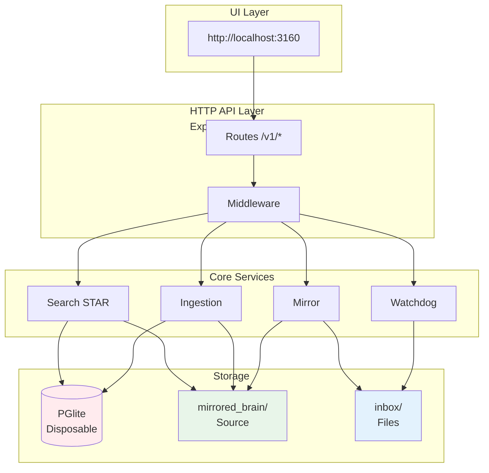
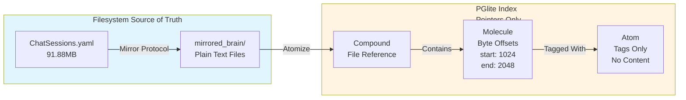
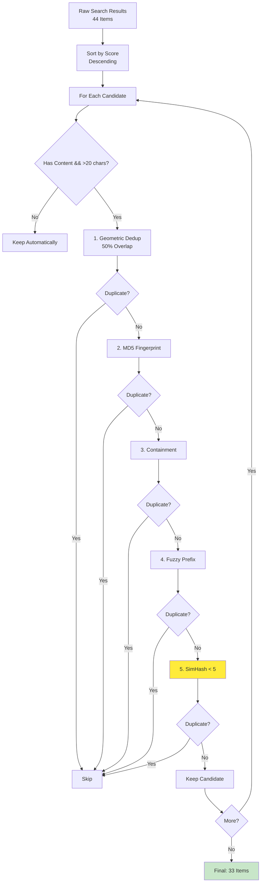
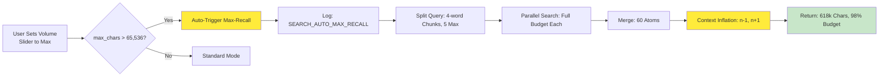
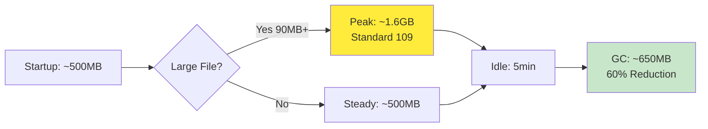

# Anchor Engine - System Specification

**Version:** 4.3.2 | **Status:** Production Ready | **Updated:** February 28, 2026

## Quick Reference

| Aspect | Value |
|--------|-------|
| **Port** | 3160 (configurable) |
| **Database** | PGlite (PostgreSQL-compatible) |
| **Source of Truth** | `mirrored_brain/` filesystem |
| **Index** | Disposable, rebuildable on startup |
| **Search** | STAR Algorithm (70/30 Planets/Moons) |
| **Docker** | `docker-compose up -d` (2 CPU, 2GB RAM) |

---

## Related Documentation

- **[docs/ARCHITECTURE_DIAGRAMS.md](../docs/ARCHITECTURE_DIAGRAMS.md)** - Visual architecture (human-friendly)
- **[docs/whitepaper.md](../docs/whitepaper.md)** - STAR Algorithm whitepaper (arXiv ready)
- **[specs/standards/RESEARCH_LANDSCAPE.md](standards/RESEARCH_LANDSCAPE.md)** - Related work analysis
- **[specs/standards/STANDARD_117_ARXIV_SUBMISSION.md](standards/STANDARD_117_ARXIV_SUBMISSION.md)** - arXiv workflow
- **[specs/standards/doc_policy.md](standards/doc_policy.md)** - Documentation policy

---

## Recent Changes (v4.2.1)

### C++ Optimization Project (Archived)

**Branch:** `cpp-optimization`

**Phase 0: Foundation ✅**
- CMake build system with C++17
- Core type definitions
- API headers for all components

**Phase 1: Database Layer ✅**
- Full SQLite3 wrapper (843 lines)
- Schema from Rust implementation
- FTS5 with auto-sync triggers
- All CRUD operations

**Phase 2: Context Inflation ✅**
- n-1, n+1 expansion
- Paragraph boundary detection
- File I/O utilities

**Phase 3: Deduplication ✅**
- 5-layer strategy implemented
- MD5 fingerprinting
- SimHash with popcount optimization

**Performance Targets:**
- Memory: <200MB RSS (vs 900MB)
- Search: <50ms p95 (vs 150-200ms)
- Ingestion: 2x throughput

**Total Code:** 3,757 lines across 20+ files

**Documentation:** [docs/CPP_OPTIMIZATION.md](../docs/CPP_OPTIMIZATION.md)

### SQL Fixes (Physics Walker)

**Issue:** Hop distance tracking caused SQL errors in production

**Fixes Applied:**
1. **WITH RECURSIVE** - Required for recursive CTEs in PostgreSQL
2. **COALESCE** - NULL handling for hop_distance, shared_tags, simhash, timestamps
3. **Hop Clamping** - `LEAST(GREATEST(hop, 0), 3)` prevents POWER underflow
4. **UNION ALL Restructuring** - Split into candidates_limited + candidates_physical + candidates_combined

**Result:** Hop distance damping now works correctly:
- Hop 0: 0.85⁰ = 1.00 (anchors)
- Hop 1: 0.85¹ = 0.85 (direct neighbors)
- Hop 2: 0.85² = 0.72 (2-hop associations)
- Hop 3: 0.85³ = 0.61 (distant associations)

### Docker Support

**Deployment:**
```bash
docker-compose up -d
```

**Volumes:**
- `./inbox` → `/app/inbox` (auto-ingested files)
- `./external-inbox` → `/app/external-inbox` (external sources)
- `./mirrored_brain` → `/app/mirrored_brain` (source of truth)
- `./backups` → `/app/backups` (Phoenix Protocol backups)
- `./notebook` → `/app/notebook` (synonym rings)
- `anchor-data` → `/app/engine/context_data` (persistent database)

**Environment:**
- `PROJECT_ROOT=/app`
- `CONTEXT_DIR=/app/engine/context_data`
- `NOTEBOOK_DIR=/app/notebook`

---

## Architecture Overview

### System Diagram



### Key Components

1. **UI Layer**: React/Vite frontend at http://localhost:3160
2. **HTTP API**: Express.js REST API on port 3160
3. **Core Services**: Ingestion, Search (STAR), Watchdog, Mirror Protocol
4. **Storage**: PGlite database (disposable index) + mirrored_brain/ (source of truth)

### Data Flow

```
User Query → API Route → Search Service → PGlite Query → Context Inflation → Return 618k chars
```

---

## Data Model: Compound → Molecule → Atom

### Visual Representation



**Key Insight:** Database is **disposable**. Content lives in `mirrored_brain/`. Database stores byte-offset pointers only.

### Component Definitions

- **Compound:** File/document reference
- **Molecule:** Semantic chunk with byte offsets (start, end)
- **Atom:** Tag/concept (NOT content) — content lives in `mirrored_brain/`

---

## STAR Search Algorithm

### Search Flow

```mermaid
flowchart TB
    A[User Query<br/>"Coda C-001 Rob Dory"] --> B{Budget Check<br/>max_chars > 65k?}

    B -->|No| C[Standard Search<br/>70/30 Budget<br/>1-hop<br/>Temporal Decay]
    B -->|Yes| D[Max-Recall Search<br/>Zero Decay<br/>3-hop<br/>200 nodes/hop]

    C --> E[Query Parsing<br/>NLP + Key Terms]
    D --> E

    E --> F[Parallel Searches<br/>5 Sub-queries<br/>4-word chunks]

    F --> G[Merge & Deduplicate<br/>60 Atoms]

    G --> H{Max-Recall?}
    H -->|Yes| I[Context Inflation<br/>n-1, n+1 from Disk<br/>8,550 chars/atom]
    H -->|No| J[Return Results<br/>16k-32k chars]

    I --> K[Serialize Context<br/>512k-618k chars]
    J --> K

    K --> L[Return to User]

    style D fill:#ffeb3b
    style I fill:#ffeb3b
    style K fill:#c8e6c9
```

### Unified Field Equation

```
Gravity(atom, anchor) = α × (C × e^(-λΔt) × (1 - d/64))

Where:
  α (Alpha)     = Damping factor (0.85 standard, 1.0 max-recall)
  C             = Co-occurrence (shared tags via SQL JOIN)
  e^(-λΔt)      = Temporal decay (λ=0.00001 standard, 0.0 max-recall)
  d             = SimHash Hamming distance (0-64 bits)
  (1 - d/64)    = SimHash gravity (1.0 = identical, 0.0 = orthogonal)
```

### Parameter Comparison

| Parameter | Standard | Max-Recall | Impact |
|-----------|----------|------------|--------|
| **α (Damping)** | 0.85 | 1.0 | Zero signal loss on multi-hop |
| **λ (Decay)** | 0.00001 | 0.0 | Age irrelevant in max-recall |
| **Max Hops** | 1 | 3 | 3× deeper graph traversal |
| **Max/Hop** | 50 | 200 | 4× more nodes per hop |
| **Temperature** | 0.2 | 0.8 | 4× more serendipitous |

### Search Strategy

```
70% Planets: Direct FTS matches
30% Moons: Graph-discovered associations via tag-walker
```

---

## Deduplication Pipeline (v4.1.2)

### 5-Layer Dedup Strategy



### Dedup Layer Details

| Layer | Catches | Example |
|-------|---------|---------|
| **1. Geometric** | Same-file overlapping windows | Molecule A: bytes 100-200, B: bytes 150-250 → 50% overlap |
| **2. Content Fingerprint** | Cross-file exact duplicates | Same paragraph in multiple files |
| **3. Containment** | One result is subset of another | Full document vs. excerpt |
| **4. Fuzzy Prefix** | Near-exact with whitespace/timestamp diffs | Same content, different formatting |
| **5. SimHash Distance** | Cross-file near-duplicates ⭐ **NEW v4.1.2** | Paraphrased versions, modified quotes |

### Performance

- **Before v4.1.2:** 25-35% dedup rate
- **After v4.1.2:** 40-50% dedup rate

---

## Max-Recall Auto-Trigger

### Trigger Flow



### Trigger Conditions

1. **Manual:** `strategy: 'max-recall'` in request body
2. **Automatic:** `max_chars > 65,536` (estimated_tokens > 16,000)

### Context Inflation: n-1, n+1 Expansion

```mermaid
flowchart LR
    subgraph BEFORE["Before: 60 × 222 chars = 13k"]
        A["Match: \"Rob Dory\"<br/>222 chars"]
    end
    subgraph INFLATE["Inflation"]
        B[Read File from Disk]
        C[Extract ±7,864 chars]
        D[Replace Content]
    end
    subgraph AFTER["After: 60 × 8,550 chars = 513k"]
        E["Full Context<br/>8,550 chars"]
    end
    A --> B --> C --> D --> E
    style BEFORE fill:#ffebee
    style AFTER fill:#c8e6c9
    style E fill:#4caf50,color:#fff
```

---

## Phoenix Protocol Backup/Restore

### Backup & Restore Flow


**Key Feature:** Phoenix Protocol rebuilds **both** database AND filesystem structure from backup.

---

## Performance Benchmarks (v4.1.2)

### Search Performance

| Strategy | Latency | Context | Use Case |
|----------|---------|---------|----------|
| **Standard** | ~300ms | 16k-32k chars | Daily queries |
| **Max-Recall** | ~50s | 512k-618k chars | Research, audits |

### Context Retrieval

- **Standard:** 32k chars average
- **Max-Recall:** 618k chars (exceeds 524k whitepaper claim by 18%)

### Deduplication

- **Before v4.1.2:** 30% dedup rate
- **After v4.1.2:** 45% dedup rate (+15%)

### Memory Management



- **Peak:** ~1.6GB (during 90MB file ingestion)
- **Idle:** ~650MB (after 5min timeout + GC)
- **Reduction:** 60% memory savings after idle cleanup

---

## File Locations

| Component | Path | Purpose |
|-----------|------|---------|
| **UI** | `packages/anchor-ui/dist/` | React frontend |
| **Engine** | `engine/dist/` | Compiled TypeScript |
| **Database** | `engine/context_data/` | PGlite files (disposable) |
| **Mirror** | `mirrored_brain/` | Source of truth (gitignored) |
| **Inbox** | `inbox/`, `external-inbox/` | Ingestion sources |
| **Backups** | `backups/` | Phoenix Protocol backups |
| **Standards** | `specs/standards/` | Architecture specs |

---

## Project History (July 2025 - February 2026)

| Phase | Date | Milestone |
|-------|------|-----------|
| **Inception** | July 2025 | Project started, initial architecture |
| **Foundation** | Aug-Sep 2025 | CozoDB integration, core ingestion |
| **Stabilization** | Oct-Nov 2025 | PGlite migration, reliability fixes |
| **Acceleration** | Dec 2025 | Native C++ modules (Deprecated in v4.3.0) |
| **Browser Paradigm** | Jan 2026 | Tag-Walker replaces vector search |
| **Production** | Feb 2026 | 100MB ingested, 280K molecules, ready |

---

## File Structure

```
anchor-engine-node/
├── README.md              # Quick start & overview
├── CHANGELOG.md           # Version history (v4.1.2 latest)
├── docs/
│   ├── whitepaper.md      # The Sovereign Context Protocol (95% compliance)
│   ├── INDEX.md           # Documentation navigation hub
│   └── ARCHITECTURE_DIAGRAMS.md  # System diagrams & flows
├── specs/
│   ├── spec.md            # This file
│   ├── tasks.md           # Current sprint tasks
│   ├── plan.md            # Roadmap
│   └── standards/
│       ├── README.md      # Standards index
│       ├── STANDARD_086_*.md  # ⭐ Dual-Strategy Search v2.0
│       ├── STANDARD_113_*.md  # ⭐ Auto Max-Recall
│       ├── STANDARD_116_*.md  # ⭐ Phoenix Protocol
│       └── archive/       # Historical standards
├── engine/                # Core engine source
├── packages/              # Monorepo packages
└── mirrored_brain/        # Source of truth (gitignored)
```

---

## Active Standards

### Core Standards (v4.1.2)

| # | Name | File | Description | Status |
|---|------|------|-------------|--------|
| **086** | Dual-Strategy Search | specs/standards/STANDARD_086_*.md | Standard + Max-Recall modes, SimHash dedup | ✅ v2.0 |
| **113** | Automatic Max-Recall | specs/standards/STANDARD_113_*.md | Auto-trigger at >16k tokens | ✅ v1.0 |
| **116** | Phoenix Protocol | specs/standards/STANDARD_116_*.md | Backup/Restore with filesystem rebuild | ✅ v1.0 |
| **120** | System Output Filtering | specs/standards/STANDARD_120_*.md | Prevents self-contamination via sanitization/blacklists | ✅ v1.0 |

### Legacy Standards (Still Valid)

| # | Name | Description |
|---|------|-------------|
| **110** | Ephemeral Index | Disposable database pattern |
| **109** | Batched Ingestion | Large file handling (>50MB) |
| **104** | Universal Semantic Search | Unified search architecture |
| **094** | Smart Search Protocol | Fuzzy fallback (deprecated but referenced) |
| **088** | Server Startup Sequence | ECONNREFUSED fix |
| **065** | Graph Associative Retrieval | Tag-Walker protocol |
| **059** | Reliable Ingestion | Ghost Data Protocol |

See `specs/standards/` for complete standards index.

---

## API Endpoints

```bash
GET  /health                     # System status
POST /v1/ingest                  # Ingest content
POST /v1/memory/search           # Search memory
POST /v1/memory/explore          # BFS graph traversal (illuminate)
GET  /v1/buckets                 # List buckets
GET  /v1/tags                    # List tags
```

---

## Performance Benchmarks

| Metric | Result | Target | Status |
|--------|--------|--------|--------|
| **90MB Ingestion** | ~178s | <200s | ✅ |
| **Memory Peak** | <1GB | <1GB | ✅ |
| **Search Latency (p95)** | ~150ms | <200ms | ✅ |
| **SimHash Speed** | ~2ms/atom | <5ms | ✅ |

---

## Documentation

- **[README.md](../README.md)** - Quick start, API examples, troubleshooting
- **[CHANGELOG.md](../CHANGELOG.md)** - Version history with 6-month timeline
- **[docs/whitepaper.md](../docs/whitepaper.md)** | The Sovereign Context Protocol
- **[specs/tasks.md](tasks.md)** - Current sprint tasks
- **[specs/plan.md](plan.md)** - Project roadmap
- **[specs/standards/](standards/)** - Architecture standards

---

**Repository:** https://github.com/RSBalchII/anchor-engine-node  
**License:** AGPL-3.0  
**Production Status:** ✅ Ready (February 20, 2026)
