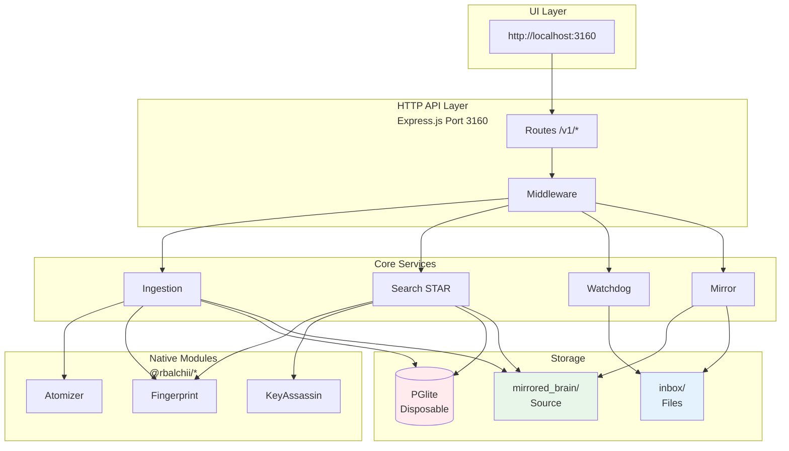

# Anchor Engine - System Specification

**Version:** 4.0.0 | **Status:** Production Ready | **Updated:** February 2026

## Quick Reference

| Aspect | Value |
|--------|-------|
| **Port** | 3160 (configurable) |
| **Database** | PGlite (PostgreSQL-compatible) |
| **Source of Truth** | `mirrored_brain/` filesystem |
| **Index** | Disposable, rebuildable on startup |
| **Search** | STAR Algorithm (70/30 Planets/Moons) |
| **Native Modules** | @rbalchii/* npm packages (C++ N-API) |

---

## Architecture Overview



### Key Components

1. **UI Layer**: React/Vite frontend at http://localhost:3160
2. **HTTP API**: Express.js REST API on port 3160
3. **Core Services**: Ingestion, Search (STAR), Watchdog, Mirror Protocol
4. **Native Modules**: C++ N-API modules for performance (@rbalchii/* packages)
5. **Storage**: PGlite database (disposable index) + mirrored_brain/ (source of truth)

### Data Flow

```
User Query → API Route → Search Service → Native Fingerprint → PGlite Query → Context Inflation → Return 618k chars
```

See **[docs/ARCHITECTURE_DIAGRAMS.md](../docs/ARCHITECTURE_DIAGRAMS.md)** for complete architecture diagrams.

### Data Model: Compound → Molecule → Atom

- **Compound:** File/document reference
- **Molecule:** Semantic chunk with byte offsets
- **Atom:** Tag/concept (content lives in `mirrored_brain/`)

### STAR Search Algorithm

```
Gravity = (SharedTags) × e^(-λΔt) × (1 - SimHashDistance/64)

70% Planets: Direct FTS matches
30% Moons: Graph-discovered associations
```

---

## Project History (July 2025 - February 2026)

| Phase | Date | Milestone |
|-------|------|-----------|
| **Inception** | July 2025 | Project started, initial architecture |
| **Foundation** | Aug-Sep 2025 | CozoDB integration, core ingestion |
| **Stabilization** | Oct-Nov 2025 | PGlite migration, reliability fixes |
| **Acceleration** | Dec 2025 | Native C++ modules (2.3x speedup) |
| **Browser Paradigm** | Jan 2026 | Tag-Walker replaces vector search |
| **Production** | Feb 2026 | 100MB ingested, 280K molecules, ready |

---

## File Structure

```
anchor-engine-node/
├── README.md              # Quick start & overview
├── CHANGELOG.md           # Version history (v4.1.2 latest)
├── docs/
│   ├── whitepaper.md      # The Sovereign Context Protocol (95% compliance)
│   ├── ARCHITECTURE_DIAGRAMS.md  # System diagrams & flows
│   └── standards/
│       ├── STANDARD_086_DUAL_STRATEGY_SEARCH.md  # ⭐ Search w/ SimHash Dedup
│       ├── STANDARD_113_AUTOMATIC_MAX_RECALL.md  # Auto-trigger >16k tokens
│       └── STANDARD_116_PHOENIX_PROTOCOL.md      # Backup/Restore system
├── specs/
│   ├── spec.md            # This file
│   ├── tasks.md           # Current sprint tasks
│   ├── plan.md            # Roadmap
│   └── standards/
│       ├── README.md      # Standards index
│       ├── 104-*.md       # ⭐ Active standards
│       └── archive/       # Historical standards
├── engine/                # Core engine source
├── packages/              # Monorepo packages
└── mirrored_brain/        # Source of truth (gitignored)
```

---

## Active Standards

### Core Standards (v4.1.2)

| # | Name | File | Description | Status |
|---|------|------|-------------|--------|
| **086** | Dual-Strategy Search | docs/standards/STANDARD_086_*.md | Standard + Max-Recall modes, SimHash dedup | ✅ v2.0 |
| **113** | Automatic Max-Recall | docs/standards/STANDARD_113_*.md | Auto-trigger at >16k tokens | ✅ v1.0 |
| **116** | Phoenix Protocol | docs/standards/STANDARD_116_*.md | Backup/Restore with filesystem rebuild | ✅ v1.0 |

### Legacy Standards (Still Valid)

| # | Name | Description |
|---|------|-------------|
| **110** | Ephemeral Index | Disposable database pattern |
| **109** | Batched Ingestion | Large file handling (>50MB) |
| **104** | Universal Semantic Search | Unified search architecture |
| **094** | Smart Search Protocol | Fuzzy fallback (deprecated but referenced) |
| **088** | Server Startup Sequence | ECONNREFUSED fix |
| **074** | Native Module Acceleration | Iron Lung Protocol |
| **065** | Graph Associative Retrieval | Tag-Walker protocol |
| **059** | Reliable Ingestion | Ghost Data Protocol |

See `docs/standards/` for complete standards index.

---

## API Endpoints

```bash
GET  /health                     # System status
POST /v1/ingest                  # Ingest content
POST /v1/memory/search           # Search memory
GET  /v1/buckets                 # List buckets
GET  /v1/tags                    # List tags
```

---

## Performance Benchmarks

| Metric | Result | Target | Status |
|--------|--------|--------|--------|
| **90MB Ingestion** | ~178s | <200s | ✅ |
| **Memory Peak** | <1GB | <1GB | ✅ |
| **Search Latency (p95)** | ~150ms | <200ms | ✅ |
| **SimHash Speed** | ~2ms/atom | <5ms | ✅ |

---

## Documentation

- **[README.md](../README.md)** - Quick start, API examples, troubleshooting
- **[CHANGELOG.md](../CHANGELOG.md)** - Version history with 6-month timeline
- **[docs/whitepaper.md](../docs/whitepaper.md)** | The Sovereign Context Protocol
- **[specs/tasks.md](tasks.md)** - Current sprint tasks
- **[specs/plan.md](plan.md)** - Project roadmap
- **[specs/standards/](standards/)** - Architecture standards

---

**Repository:** https://github.com/RSBalchII/anchor-engine-node  
**License:** AGPL-3.0  
**Production Status:** ✅ Ready (February 20, 2026)
